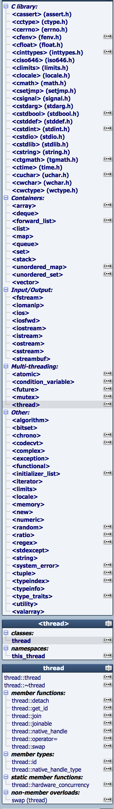

History of C++：[cppreference](http://en.cppreference.com/w/cpp/language/history) / [cplusplus](http://www.cplusplus.com/info/history/)  

## [C standard library](https://en.wikipedia.org/wiki/C_standard_library)
The **C standard library** or **libc** is the standard library for the [C programming language](https://en.wikipedia.org/wiki/C_(programming_language)), as specified in the [ANSI C](https://en.wikipedia.org/wiki/ANSI_C) standard.
Since ANSI C was adopted by the [International Organization for Standardization](https://en.wikipedia.org/wiki/International_Organization_for_Standardization), the C standard library is also called the **ISO C library**.
The C standard library provides [macros](https://en.wikipedia.org/wiki/Macro_(computer_science)), type definitions and functions for tasks such as [string](https://en.wikipedia.org/wiki/Character_string_(computer_science)) handling, mathematical computations, input/output processing, [memory management](https://en.wikipedia.org/wiki/Memory_management), and several other [operating system](https://en.wikipedia.org/wiki/Operating_system) services.

### Header Files
The [application programming interface](https://en.wikipedia.org/wiki/Application_programming_interface) (API) of the C standard library is declared in a number of [header files](https://en.wikipedia.org/wiki/Header_file). Each header file contains one or more function declarations, data type definitions, and macros.

After a long period of stability, three new header files (`iso646.h`, `wchar.h`, and `wctype.h`) were added with *Normative Addendum 1* (NA1), an addition to the C Standard ratified in 1995. Six more header files (`complex.h`, `fenv.h`, `inttypes.h`, `stdbool.h`, `stdint.h`, and `tgmath.h`) were added with [C99](https://en.wikipedia.org/wiki/C99), a revision to the C Standard published in 1999, and five more files (`stdalign.h`, `stdatomic.h`, `stdnoreturn.h`, `threads.h`, and `uchar.h`) with [C11](https://en.wikipedia.org/wiki/C11_(C_standard_revision)) in 2011. In total, there are now 29 header files.

## [C++ Standard Library](https://en.wikipedia.org/wiki/C%2B%2B_Standard_Library)

### STL
[C++STL概览](http://www.cnblogs.com/ggjucheng/archive/2012/01/03/2310884.html)  
[C++:STL标准入门汇总](http://www.cnblogs.com/shiyangxt/archive/2008/09/11/1289493.html)  
[三十分钟掌握STL](http://net.pku.edu.cn/~yhf/UsingSTL.htm)  

[C++ STL](http://blog.csdn.net/column/details/stl-morewindows.html)  
[Standard Containers](http://www.cplusplus.com/reference/stl/)  
