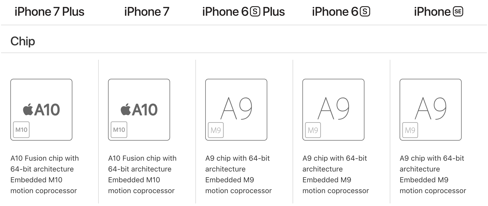

# iPhone Chips

| Chip                                                 | ARM Architecture                                               | Word Size | Product      | Time               |
| ---------------------------------------------------- | -------------------------------------------------------------- | --------- | ------------ | ------------------ |
| [Apple A4](https://en.wikipedia.org/wiki/Apple_A4)   | ARM Cortex-A8                                                  | 32-bit    | iPhone 4     | January 27, 2010   |
| [Apple A5](https://en.wikipedia.org/wiki/Apple_A5)   | ARM Cortex-A9                                                  | 32-bit    | iPhone 4S    | October 2011       |
| [Apple A6](https://en.wikipedia.org/wiki/Apple_A6)   | [ARMv7-A](https://en.wikipedia.org/wiki/ARM_Cortex-A15_MPCore) | 32-bit    | iPhone 5(C)  | September 12, 2012 |
| [Apple A7](https://en.wikipedia.org/wiki/Apple_A7)   | ARMv8-A                                                        | 64-bit    | iPhone 5S    | September 10, 2013 |
| [Apple A8](https://en.wikipedia.org/wiki/Apple_A8)   | ARMv8-A                                                        | 64-bit    | iPhone 6(+)  | September 9, 2014  |
| [Apple A9](https://en.wikipedia.org/wiki/Apple_A9)   | ARMv8-A                                                        | 64-bit    | iPhone 6S(+) | September 9, 2015  |
| [Apple A10](https://en.wikipedia.org/wiki/Apple_A10) | ARMv8-A                                                        | 64-bit    | iPhone 7(+)  | September 7, 2016  |

iPhone 4S 的 Apple A5 和 iPhone 5(C) 的 **Apple A6** 都是基于 32-bit 的 `ARMv7-A` 架构；  
iPhone 5S 之后的 **Apple A7~A10** 开始基于 64-bit 的 `ARMv8-A` 架构。  

## [Apple A7](https://en.wikipedia.org/wiki/Apple_A7)
***Cyclone***

The 64-bit A64 instruction set in the ARMv8-A architecture **doubles** the number of registers of the A7 compared to the ARMv7 architecture used in A6.  
It has **31** general purpose registers that are each 64-bits wide and **32** floating-point/NEON registers that are each 128-bits wide.

## [Apple_A9](https://en.wikipedia.org/wiki/Apple_A9)
***Twister***

[Apple_A9X](https://en.wikipedia.org/wiki/Apple_A9X)

[iPhone 6s: How fast is the new A9 processor?](http://bgr.com/2015/09/18/iphone-6s-a9-processor-specs/)  
[It Doesn’t Matter Which A9 Chip Your iPhone Has. Get Over It](https://www.wired.com/2015/10/iphone-6s-a9-battery-life/)

## [Apple_A10](https://en.wikipedia.org/wiki/Apple_A10)
***Hurricane***

[Apple_A10X](https://en.wikipedia.org/wiki/Apple_A10X)

['A10 chip' Articles](https://www.macrumors.com/roundup/a10-chip/)  
[iPhone 7 Teardown Reveals 'Incredibly Thin' A10 Chip With 2GB RAM, Intel Modem](https://www.macrumors.com/2016/09/16/iphone-7-chipworks-teardown/)  
[The iPhone 7’s new A10 Fusion: quad-core, high-efficiency, and a more powerful GPU](https://www.extremetech.com/computing/235140-apples-new-a10-fusion-quad-core-high-efficiency-and-a-more-powerful-gpu)  
[The iPhone's new chip should worry Intel](https://www.theverge.com/2016/9/16/12939310/iphone-7-a10-fusion-processor-apple-intel-future)  
['Fastest smartphone chip ever,' the A10 Fusion, powers Apple's new iPhone 7](https://www.macworld.com/article/3117593/apple-phone/fastest-smartphone-chip-ever-the-a10-fusion-powers-apples-new-iphone-7.html)

## refs

[Xcode 中 armv6,armv7,armv7s,arm64,i386 x86_64 归纳](https://www.jianshu.com/p/09b445300d40)

[Differences between compiling for i386 vs x86_64 in Xcode?](https://stackoverflow.com/questions/3266902/differences-between-compiling-for-i386-vs-x86-64-in-xcode)
