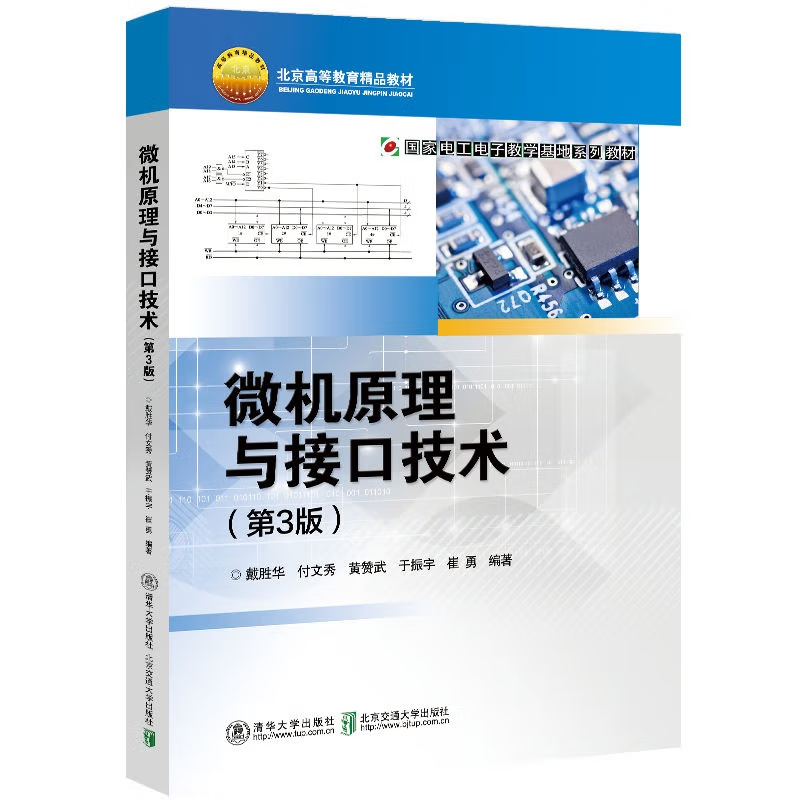

[TOC]

## 微机原理及汇编语言教程(杨延双)

[微机原理及汇编语言教程](https://www.amazon.cn/%E5%BE%AE%E6%9C%BA%E5%8E%9F%E7%90%86%E5%8F%8A%E6%B1%87%E7%BC%96%E8%AF%AD%E8%A8%80%E6%95%99%E7%A8%8B-%E6%9D%A8%E5%BB%B6%E5%8F%8C/dp/B006DAAR0E/ref=sr_1_28?ie=UTF8&qid=1504919128&sr=8-28&keywords=%E5%BE%AE%E6%9C%BA%E5%8E%9F%E7%90%86+%E6%B1%87%E7%BC%96) 平装 – 2002年6月1日  
杨延双 (作者), 张晓冬 (作者), 魏坚华 (作者)  

- 丛书名: 高校计算机教学系列教材,北京高等教育精品教材  
- 出版社: 北京航空航天大学出版社; 第1版 (2002年6月1日)  
- 平装: 219页  
- 作者单位：北京工业大学  

---

[微机原理及汇编语言教程（第2版）](https://item.jd.com/10026807582274.html)

- 丛书名：高职高专“十一五”规划示范教材  
- 出版社：北京航空航天大学出版社  
- 出版日期：2010-05-01  
- 页码：278  

## 微机原理与汇编语言(武洪娟)

[微机原理与汇编语言](https://www.amazon.cn/%E5%BE%AE%E6%9C%BA%E5%8E%9F%E7%90%86%E4%B8%8E%E6%B1%87%E7%BC%96%E8%AF%AD%E8%A8%80/dp/B003Z5NJEQ/ref=sr_1_1?ie=UTF8&qid=1504919359&sr=8-1&keywords=%E5%BE%AE%E6%9C%BA%E5%8E%9F%E7%90%86%E4%B8%8E%E6%B1%87%E7%BC%96%E8%AF%AD%E8%A8%80) @[jd](https://item.jd.com/10046443466541.html) 平装 – 2010年7月1日  
武洪娟 (编者)  

- 丛书名: 高等职业教育计算机类专业“十一五”规划教材  
- 出版社: 国防工业出版社; 第1版 (2010年7月1日)  
- 平装: 223页  

## 微机原理与接口技术(毛红旗)

[微机原理与接口技术(第2版)](https://www.amazon.cn/%E5%BE%AE%E6%9C%BA%E5%8E%9F%E7%90%86%E4%B8%8E%E6%8E%A5%E5%8F%A3%E6%8A%80%E6%9C%AF-%E6%AF%9B%E7%BA%A2%E6%97%97/dp/B009PKU614/ref=sr_1_27?ie=UTF8&qid=1504919390&sr=8-27&keywords=%E5%BE%AE%E6%9C%BA%E5%8E%9F%E7%90%86%E4%B8%8E%E6%B1%87%E7%BC%96%E8%AF%AD%E8%A8%80) @[jd](https://item.jd.com/1067968624.html) 平装 – 2012年7月1日  
毛红旗 (作者), 刘敏 (作者), 杨洪亮 (作者)  

- 丛书名: 高等学校“十二五”规划教材  
- 出版社: 中国铁道出版社; 第2版 (2012年7月1日)  
- 平装: 235页  
- 作者单位：临沂大学教授  

## 微机原理与接口技术(戴胜华)

[微机原理与接口技术（第3版）](https://item.jd.com/12760128.html)

戴胜华，付文秀，黄赞武，于振字，崔勇 著

- 丛书名： 北京高等教育精品教材，国家电工电子教学基地系列教材  
- 出版社： 清华大学出版社，北京交通大学出版社  
- 出版时间：2019-10-01  
- 页数：370  
- 作者单位：北京交通大学教授  

### MOOC

中国大学MOOC：[微机原理与接口技术](https://www.icourse163.org/course/NJTU-1002080018?tid=1468328453)
