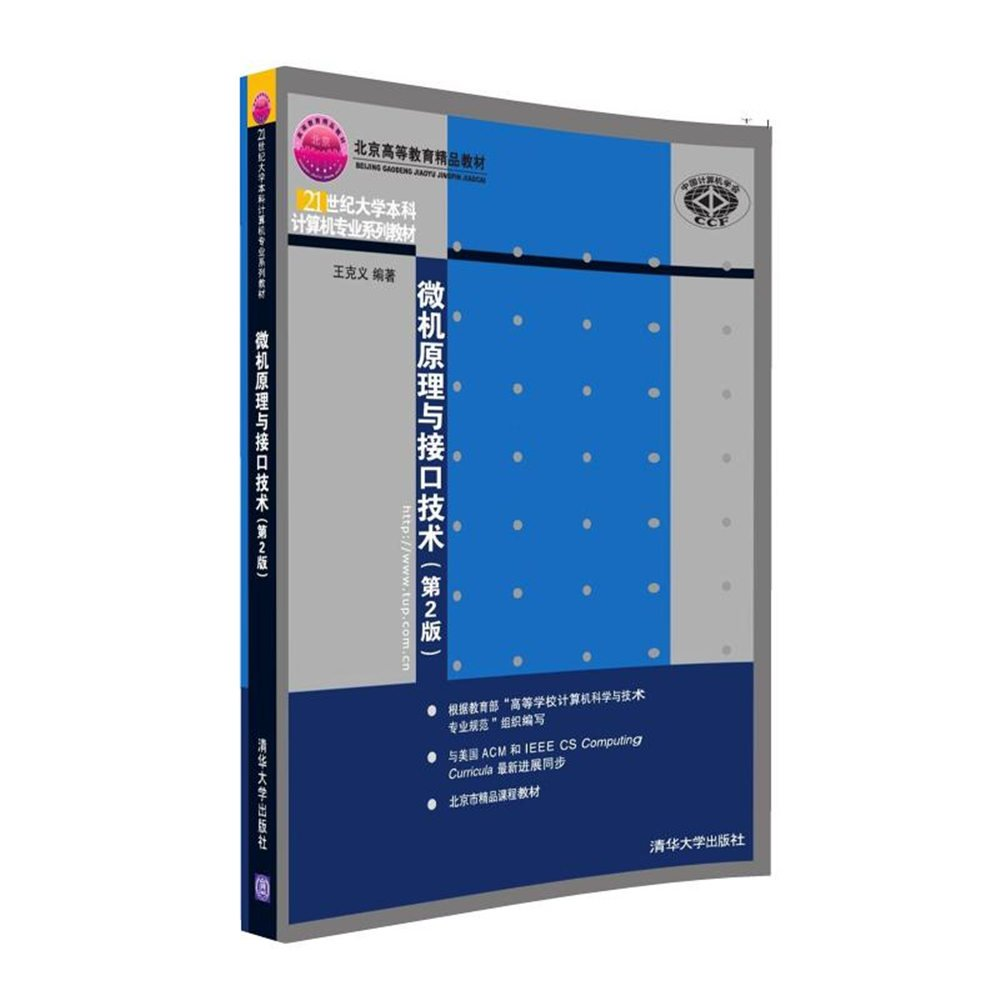

[TOC]

## 微机原理与接口技术(牟琦)

[微机原理与接口技术(第2版)](https://www.amazon.cn/21%E4%B8%96%E7%BA%AA%E6%99%AE%E9%80%9A%E9%AB%98%E6%A0%A1%E8%AE%A1%E7%AE%97%E6%9C%BA%E5%85%AC%E5%85%B1%E8%AF%BE%E7%A8%8B%E8%A7%84%E5%88%92%E6%95%99%E6%9D%90-%E5%BE%AE%E6%9C%BA%E5%8E%9F%E7%90%86%E4%B8%8E%E6%8E%A5%E5%8F%A3%E6%8A%80%E6%9C%AF/dp/B00D755L68/ref=pd_sbs_14_7?ie=UTF8&psc=1&refRID=DEYSH6T6ABT213JRBY2B) @[jd](https://item.jd.com/11253024.html) 平装 – 2013年5月1日  
牟琦 (编者)  

- 丛书名: 21世纪普通高校计算机公共课程规划教材  
- 出版社: 清华大学出版社; 第2版 (2013年5月1日)  
- 平装: 360页  
- 作者单位：西安科技大学副教授  

---

[微机原理与接口技术（第3版）](https://item.jd.com/13671476.html)
牟琦 著

- 21世纪高等学校计算机专业核心课程规划教材  
- 出版社：清华大学出版社  
- 出版时间：2018-10-01  
- 页数：383  

## 微型计算机原理与接口技术(吴宁)

[微型计算机原理与接口技术（第4版）](https://item.jd.com/12908061.html)

吴宁，乔亚男 编，冯博琴主审

- 丛书名：国家级一流本科课程配套教材，高等学校计算机基础教育教材
- 出版社：清华大学出版社
- 出版时间：2016-09-01
- 页数：370
- 作者单位：西安交通大学教授

---

[微型计算机原理与接口技术（第5版）](https://item.jd.com/13377839.html)

吴宁，闫相国 著

- 丛书名：新时代大学计算机通识教育教材
- 出版社： 清华大学出版社
- 出版时间：2022-08-01

### MOOC

中国大学MOOC：[微机原理与接口技术](https://www.icourse163.org/course/XJTU-1001647001)

- [B站视频](https://www.bilibili.com/video/BV1bE411N7Zw/?vd_source=a04bc3b29d86445799e2523eeb174b10)

## 微机原理与接口技术(王克义)

[微机原理与接口技术(第2版)](https://www.amazon.cn/%E5%9B%BE%E4%B9%A6/dp/B01K6ZVKWU/ref=sr_1_10?ie=UTF8&qid=1504918990&sr=8-10&keywords=%E5%BE%AE%E6%9C%BA%E5%8E%9F%E7%90%86+%E6%B1%87%E7%BC%96) @[jd](https://item.jd.com/71473596246.html) 平装 – 2016年7月30日  
王克义 (作者)  

- 出版社: 清华大学出版社; 第2版 (2016年7月30日)  
- 外文书名: Microcomputer Principle and Interfacing (2nd Edition)  
- 丛书名: 21世纪大学本科计算机专业系列教材  
- 平装: 375页  
- 作者单位：北京大学教授  

<!---->

- [B站视频](https://www.bilibili.com/video/BV1K34y1a7UD/?vd_source=a04bc3b29d86445799e2523eeb174b10)

## 微机原理：结构、编程与接口(王克义)

[微机原理：结构、编程与接口（第2版）](https://item.jd.com/12143475.html)

王克义 著

本书为国家精品课程《微机原理》的配套教材，作者为北京大学优秀教师，北京市优秀教师。本书内容精炼，实用性强。

- 出版社： 清华大学出版社  
- 丛书名： 高等学校计算机科学与技术教材  
- 出版时间：2017-08-01  
- 页数：362  

## 微型计算机系统原理及应用(周明德)

[微型计算机系统原理及应用（第六版）](https://item.jd.com/12394496.html)

周明德 著

周明德教授经典力作新版，第一版是在1985年出版，曾获全国畅销书一等奖
满足技术进步和教学改革要求，增加计算机新技术及应用内容

- 出版社： 清华大学出版社  
- 出版时间：2018-06-01  
- 页数：439  
- 作者单位：清华大学教授  

