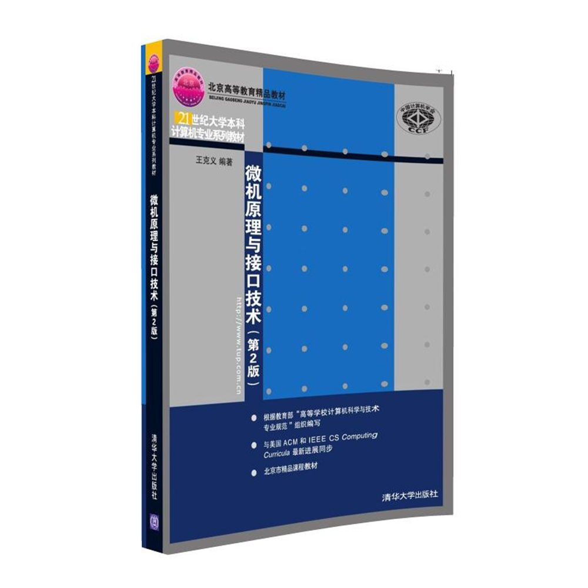

## 微机原理及汇编语言教程
[微机原理及汇编语言教程](https://www.amazon.cn/%E5%BE%AE%E6%9C%BA%E5%8E%9F%E7%90%86%E5%8F%8A%E6%B1%87%E7%BC%96%E8%AF%AD%E8%A8%80%E6%95%99%E7%A8%8B-%E6%9D%A8%E5%BB%B6%E5%8F%8C/dp/B006DAAR0E/ref=sr_1_28?ie=UTF8&qid=1504919128&sr=8-28&keywords=%E5%BE%AE%E6%9C%BA%E5%8E%9F%E7%90%86+%E6%B1%87%E7%BC%96) 平装 – 2002年6月1日  
杨延双 (作者), 张晓冬 (作者), 魏坚华 (作者)  

- 出版社: 北京航空航天大学出版社; 第1版 (2002年6月1日)  
- 丛书名: 高校计算机教学系列教材,北京高等教育精品教材  
- 平装: 219页  

@img 

## 微机原理与汇编语言
[微机原理与汇编语言](https://www.amazon.cn/%E5%BE%AE%E6%9C%BA%E5%8E%9F%E7%90%86%E4%B8%8E%E6%B1%87%E7%BC%96%E8%AF%AD%E8%A8%80/dp/B003Z5NJEQ/ref=sr_1_1?ie=UTF8&qid=1504919359&sr=8-1&keywords=%E5%BE%AE%E6%9C%BA%E5%8E%9F%E7%90%86%E4%B8%8E%E6%B1%87%E7%BC%96%E8%AF%AD%E8%A8%80) 平装 – 2010年7月1日  
武洪娟 (编者)  

- 出版社: 国防工业出版社; 第1版 (2010年7月1日)  
- 丛书名: 高等职业教育计算机类专业“十一五”规划教材  
- 平装: 223页  

@img 
## 微机原理与接口技术
[微机原理与接口技术(第2版)](https://www.amazon.cn/%E5%BE%AE%E6%9C%BA%E5%8E%9F%E7%90%86%E4%B8%8E%E6%8E%A5%E5%8F%A3%E6%8A%80%E6%9C%AF-%E6%AF%9B%E7%BA%A2%E6%97%97/dp/B009PKU614/ref=sr_1_27?ie=UTF8&qid=1504919390&sr=8-27&keywords=%E5%BE%AE%E6%9C%BA%E5%8E%9F%E7%90%86%E4%B8%8E%E6%B1%87%E7%BC%96%E8%AF%AD%E8%A8%80) 平装 – 2012年7月1日  
毛红旗 (作者), 刘敏 (作者), 杨洪亮 (作者)  

- 出版社: 中国铁道出版社; 第2版 (2012年7月1日)  
- 丛书名: 高等学校“十二五”规划教材  
- 平装: 235页  

@img 

## 微机原理与接口技术
[微机原理与接口技术(第2版)](https://www.amazon.cn/21%E4%B8%96%E7%BA%AA%E6%99%AE%E9%80%9A%E9%AB%98%E6%A0%A1%E8%AE%A1%E7%AE%97%E6%9C%BA%E5%85%AC%E5%85%B1%E8%AF%BE%E7%A8%8B%E8%A7%84%E5%88%92%E6%95%99%E6%9D%90-%E5%BE%AE%E6%9C%BA%E5%8E%9F%E7%90%86%E4%B8%8E%E6%8E%A5%E5%8F%A3%E6%8A%80%E6%9C%AF/dp/B00D755L68/ref=pd_sbs_14_7?ie=UTF8&psc=1&refRID=DEYSH6T6ABT213JRBY2B) 平装 – 2013年5月1日  
牟琦 (编者)  

- 出版社: 清华大学出版社; 第2版 (2013年5月1日)  
- 丛书名: 21世纪普通高校计算机公共课程规划教材  
- 平装: 360页  

@img 

## 微机原理与接口技术
[微机原理与接口技术(第2版)](https://www.amazon.cn/%E5%9B%BE%E4%B9%A6/dp/B01K6ZVKWU/ref=sr_1_10?ie=UTF8&qid=1504918990&sr=8-10&keywords=%E5%BE%AE%E6%9C%BA%E5%8E%9F%E7%90%86+%E6%B1%87%E7%BC%96) 平装 – 2016年7月30日  
王克义 (作者)  

- 出版社: 清华大学出版社; 第2版 (2016年7月30日)  
- 外文书名: Microcomputer Principle and Interfacing (2nd Edition)  
- 丛书名: 21世纪大学本科计算机专业系列教材  
- 平装: 375页  

<!---->

