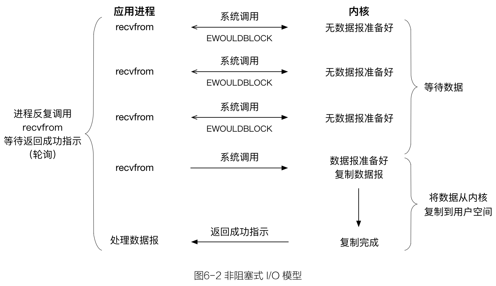
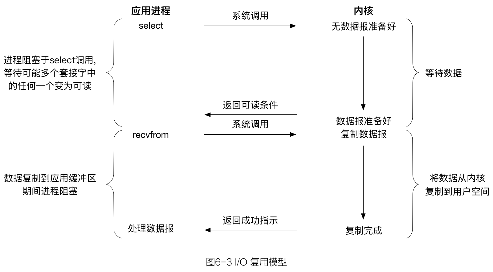
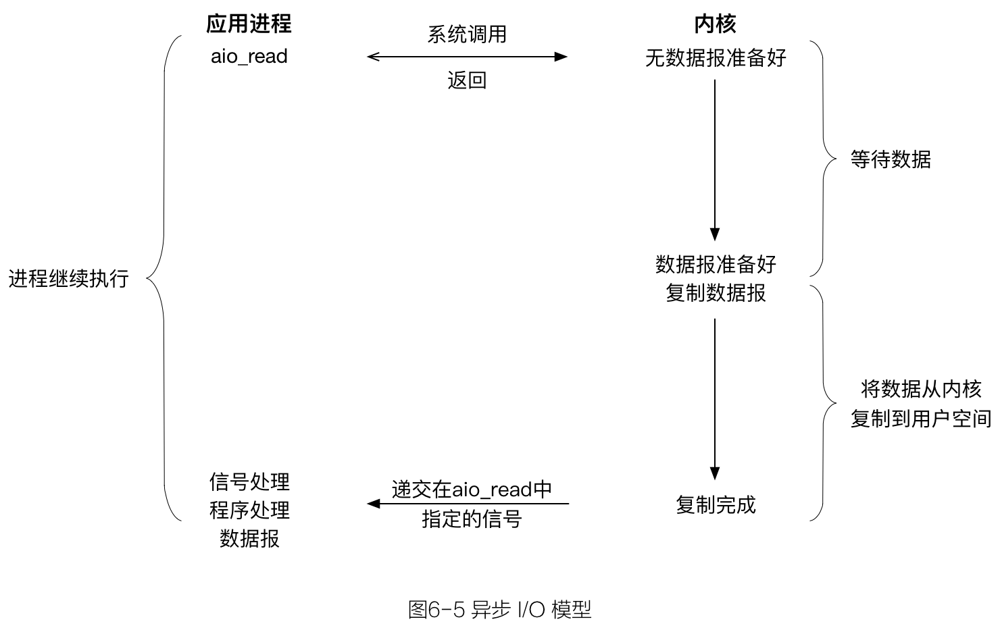
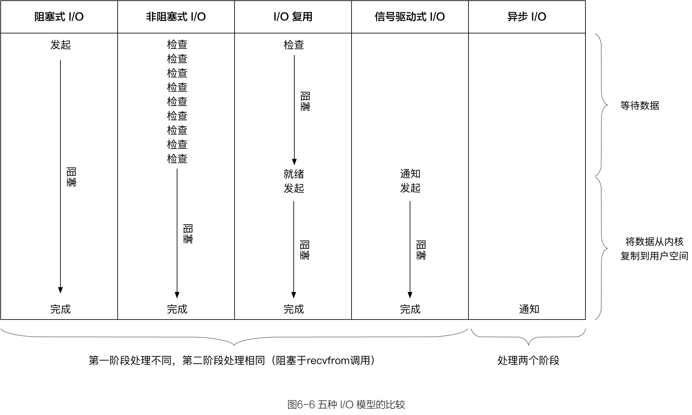

工作越来越忙，很久没有读书了，心里越来越空荡。
周末有空闲来在家，艳阳高照酷暑难耐，信手翻阅《UNIX 网络编程 卷1：套接字联网 API》第6章《I/O 复用：select 和 poll 函数》，以下权当学习摘要。

## 6.2 I/O 模型

Unix 下有5种可用的 I/O 模型：

- 阻塞式I/O（blocking I/O）；  
- 非阻塞式I/O（nonblocking I/O）；  
- I/O 复用（ I/O multiplexing）：select 和 poll；  
- 信号驱动式I/O（signal driven I/O）：SIGIO；  
- 异步I/O（asynchronous I/O）：POSIX 的 aio_ 系列函数。

一般情况下，一次⽹网络I/O读操作会包含两个不同的阶段：

1. 等待数据准备好（Waiting for the data to be ready）；  
2. 从内核向进程复制数据（Copying the data from the kernel to the process）。  

I/O 模型的异同点就在这两个处理理阶段上。

### 6.2.1 阻塞式 I/O 模型

最流行的 I/O 模型是 阻塞式 I/O 模型。默认情形下，所有的套接字都是阻塞的。

这里使用 UDP 而不是 TCP 示意的原因在于，就 UDP 而言”数据准备好读取”的概念相对简单，要么整个数据报已经收到，要么还没有。对于 TCP 而言，诸如套接字低水位标记（low-water mark）等额外变量开始起作用，导致这个概念变得复杂。

我们把 `recvfrom` 函数视作**系统调用**，一般都会从应用进程空间运行**切换**到在内核空间中运行，一段时间之后再**切换**回来。  
在上图中，进程调用 `recvfrom`，其系统调用直到数据报到达且被复制到应用进程的缓冲区中或者发生错误才返回。我们说进程在从调用  `recvfrom` 开始到它返回的整段时间内是被阻塞的。 `recvfrom` 成功返回后，应用进程开始处理数据报。

> blocking I/O 的特点是在 I/O 执行的两个阶段都被阻塞了。

### 6.2.2 非阻塞式 I/O 模型

进程把一个套接字设置成非阻塞是在通知内核：当所请求的I/O操作非得把本进程投入睡眠才能完成时，**不要**把本进程投入睡眠，**而是**返回一个错误。

前三次调用  `recvfrom`  时没有数据可返回，因此内核转而返回一个 *`EWOULDBLOCK`* 错误。第四次调用  `recvfrom`  时已有一个数据报准备好，它被复制到应用进程缓冲区，于是  `recvfrom`  成功返回，我们接着处理数据。

当一个应用进程像这样对一个非阻塞描述符**循环**调用  `recvfrom`  时，我们称之为**轮询**（polling）。应用进程持续轮询内核，以查看某个操作**是否就绪**。这么做往往耗费大量CPU时间，不过这种模型偶尔也会遇到，通常是在专门提供某一种功能的系统中才有。

> nonblocking I/O 的特点是用户进程需要**不断的主动询问**内核数据是否到来。

### 6.2.3 I/O 复用模型

有了 I/O 复用模型，我们就可以调用 `select` 或 `poll`，**阻塞**在这两个系统调用中的某一个之上，而**不是**阻塞在真正的I/O系统调用上。

我们阻塞在 `select` 调用，等待数据报套接字变为可读。当 `select` 返回套接字可读这一条件时，我们调用 `recvfrom` 把所读数据报复制到应用进程缓冲区。

比较图6-3和图6-1，I/O复用并不显得有什么优势，两个处理阶段都是阻塞等待的。
事实上由于使用 `select` 需要**两个**而不是单个系统调用，I/O复用还稍有劣势。不过，使用 `select` 的优势在于我们可以***等待多个***描述符就绪。

> I/O 多路复用的特点是通过一种机制一个进程能同时监听等待多个文件描述符，而这些文件描述符（套接字描述符）其中的任意一个进入读就绪状态，select/poll 函数就可以返回。

### 6.2.4 信号驱动式 I/O 模型

略。

### 6.2.5 异步 I/O 模型

异步 I/O 是由 POSIX 规范定义，演变成当前 POSIX 规范的各种早期标准所定义的*实时*函数中存在的差异已经取得一致。一般来说，这些函数的工作机制是：
告知内核启动某个操作，并让内核在整个操作（包括将数据从内核复制到用户空间的应用缓冲区）完成后**通知**我们。

异步 I/O 模型与信号驱动模型的主要区别在于：信号驱动式 I/O 是由内核通知我们何时可以**启动**一个 I/O 操作，而异步 I/O 模型是由内核通知我们 I/O 操作何时**完成**。

我们调用 `aio_read` 函数（POSIX 异步 I/O 函数以 aio_ 或 lio_ 开头），给内核传递描述符、缓冲区指针、缓冲区大小（与 `read` 相同的三个参数）和文件偏移（和 `lseek` 类似），并告诉内核当整个操作完成时如何通知我们。该系统调用**立即返回**，而且在等待I/O完成期间，我们的进程***不被阻塞***。本例中我们假设要求内核在操作完成时产生某个信号。该信号直到数据已复制到应用进程缓冲区才产生，这一点不同于信号驱动式 I/O 模型。

> 本书编写至此的时候，支持 POSIX 异步 I/O 模型的系统仍属罕见。
遗憾的是，linux 的网络 I/O 中是不存在异步 I/O 的，第⼆阶段总是阻塞等待数据 copy 完成。真正意义上的⽹络异步 I/O 是 Windows 下的 IOCP（[I/O 完成端口](http://blog.csdn.net/phunxm/article/details/5085944)）模 型。

### 6.2.6 各种 I/O 模型的比较

图6-6对比了五种不同的 I/O 模型。可以看出，前四种模型的主要区别在于第一阶段，因为它们在第二阶段都是一样的：在数据从内核复制到调用者的缓冲区期间，进程阻塞于 `recvfrom` 调用。相反，异步 I/O 模型在这两个阶段都要处理，从而不同于其他四种模型。

#### blocking 和 non-blocking 的区别

调用 blocking I/O 会一直阻塞住对应的进程直到操作完成；而 non-blocking I/O 在  kernel 还在准备数据的情况下会立刻返回。

#### synchronous 和 asynchronous 的区别

在说明 synchronous IO 和 asynchronous IO 的区别之前，需要先给出两者的定义。
POSIX 的定义是这样子的：

- A **synchronous** I/O operation causes the requesting process to be blocked until that I/O operation completes(导致请求进程阻塞，直到 I/O 操作完成)；  
- An **asynchronous** I/O operation does not cause the requesting process to be blocked(不导致请求进程阻塞)。  

两者的区别就在于 synchronous IO 做 **I/O operation** 的时候会将 process 阻塞。
根据以上定义，之前所述的 `blocking I/O`，`non-blocking I/O`，`I/O multiplexing` 和 `signal driven I/O` 都属于 synchronous I/O。

## 话题探究

### non-blocking 与 asynchronous 的区别

有人会说，non-blocking I/O 并没有被 block 啊。这里需要明确的是定义中所指的”I/O operation”是指真实的 I/O 操作，就是例子中的 `recvfrom` 这个系统调用（system call）。  
non-blocking I/O 在执行 `recvfrom` 这个 system call 的时候，如果 kernel 的数据没有准备好，这时候不会 block 进程。但是，当 kernel 中数据准备好的时候，`recvfrom` 会将数据从 kernel 拷贝到用户内存中，这个时候进程是被 block 了，在这段时间内，进程是被 block 的。

non-blocking I/O 仅仅要求处理的**第⼀阶段**不 block 即可，⽽ asynchronous I/O 要求**两个阶段**都不能 block 住。

### [Reactor 模式和 Proactor 模式](http://blog.csdn.net/tgxallen/article/details/71083779)

在高性能服务器并发模型设计中，Reactor 和 Proactor 是两个经常用到的设计模式：前者用于同步 I/O，后者用于异步 I/O。  
前者在 I/O 操作就绪的情况下通知用户，用户再采取实际的 I/O 操作；后者是在 I/O 操作完成后通知用户。  
IOCP 的设计就是 Proactor 模式的完美体现；而 epoll 则很容易实现 Reactor 模式；asio 设计为跨平台，并且在 linux 下采用 epoll。

#### libevent

本质上来讲 libevent 应该是同步的，因为如果看到底层封装的 select 和 epoll 就会发现，里面仍然是个 while 循环在轮询是否准备就绪。
libevent 本身是一个 Reactor，是同步的。但 libevent 的 bufferevent 是用 Reactor 实现了一个 Proactor，所以 libevent 又是异步的。

#### libuv

当接口可读时，libuv 会调用你的 allocate callback 来申请内存并将读到的内容写入。
当读取完毕后，libuv 会调用你为这个 socket 设置的回调函数，在参数中带着这个 buffer 信息。你只需要负责处理这个 buffer 并且free 掉就好了。因为是从 buffer 中读取数据，在你的 callback 被调用时数据已经 ready 了，所以程序员也就不用考虑阻塞的问题了。

而对写的处理则更显巧妙。libuv 没有 write callback ，如果你想写东西，直接 generate 一个 write request 连带要写的 buffer 一起丢给 libuv ，libuv 会把你的 write request 加进相应 socket 的 write queue ，在 I/O 可写时按顺序写入。

C 语言是没有原生支持 closure，否则 closure 应是 callback 机制最价解决方案。  而 C 语言模拟 closure 的方法是用一个 `function` 并携带一个 `void* ud`，此 ud 即原本应该在 closure 中绑定的数据块。ud 指针可存储结构化的参数地址，用于指向用户数据。  
libuv 用了大量 callback 机制来完成异步 IO 的回调。这些 callback 函数通常都带有一个参数 uv_stream_t 或 uv_req_t 等，这个数据表示这次 callback 绑定的数据 。  
当 buffer 抛上来的时候，只需要简单的把 data cast 为预定类型，从而还原确定出读写上下文。

## 参考

I/O多路复用之 [select](http://www.cnblogs.com/Anker/p/3258674.html)、[poll](http://www.cnblogs.com/Anker/p/3261006.html)、[epoll](http://www.cnblogs.com/Anker/p/3263780.html) 示例及 [总结](http://www.cnblogs.com/Anker/p/3265058.html)  
[Linux I/O 模式及 select、poll、epoll 详解](https://segmentfault.com/a/1190000003063859)  
[OSX/iOS中多路I/O复用总结](http://www.tanhao.me/pieces/1777.html/)  
[再谈 select,iocp,epoll,kqueue 及各种 I/O 复用机制](http://blog.csdn.net/shallwake/article/details/5265287)  

[Linux 下 select & poll 的实现原理简析](http://www.cnblogs.com/lanyuliuyun/p/5011526.html)  
[linux 内核 select/poll/epoll 源码实现剖析](http://blog.csdn.net/lishenglong666/article/details/45536611)  

[那些年我们追过的网络库](https://bbs.avplayer.org/t/topic/654)  
[关于网络通信模型的剖析：libevent libev libuv asio](http://blog.csdn.net/tgxallen/article/details/71083779)  
[使用 libevent 和 libev 提高网络应用性能——I/O模型演进变化史](http://blog.csdn.net/hguisu/article/details/38638183)  
