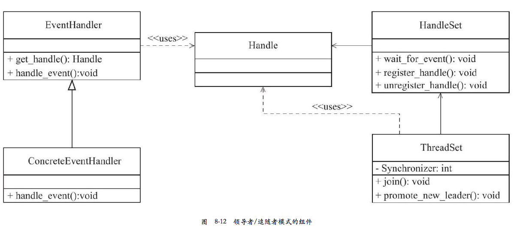

[Linux高性能服务器编程](https://book.douban.com/subject/24722611/)

[部分摘要](https://www.jianshu.com/p/dc337f61831e)，[**读书笔记**](https://ningning.today/booknotes/unix_linux/Linux%E9%AB%98%E6%80%A7%E8%83%BD%E6%9C%8D%E5%8A%A1%E5%99%A8%E7%BC%96%E7%A8%8B/Linux%E9%AB%98%E6%80%A7%E8%83%BD%E6%9C%8D%E5%8A%A1%E5%99%A8%E7%BC%96%E7%A8%8B/)，[一些收获](http://luodw.cc/2016/04/29/HighLinux/)  

[Linux高性能服务器编程-专栏](https://blog.csdn.net/gatieme/column/info/high-per-server)  

[Linux 高性能服务器编程——高性能服务器程序框架](https://blog.csdn.net/fanyun_01/article/details/78975872)  
[Linux高性能服务器编程——线程池](https://blog.csdn.net/zhuoya_/article/details/78724637)  
