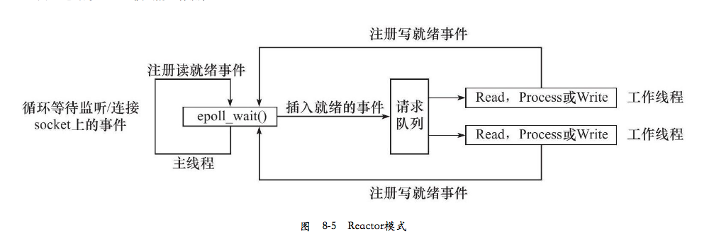
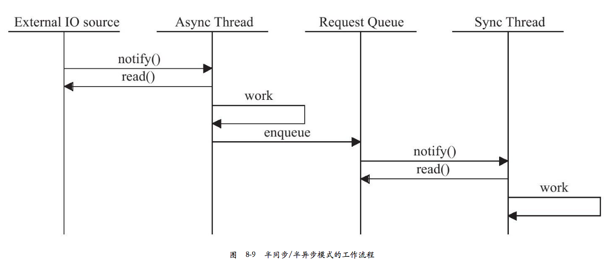

[Linux高性能服务器编程模式](https://rustlang-cn.org/read/rust/2018/Linux%E9%AB%98%E6%80%A7%E8%83%BD%E6%9C%8D%E5%8A%A1%E5%99%A8%E7%BC%96%E7%A8%8B%E6%A8%A1%E5%BC%8F.html)  

## 两种高效的事件处理模式

[两种高效的事件处理模式](https://www.cnblogs.com/lojunren/p/3852514.html)  
[高性能IO模型浅析](https://www.cnblogs.com/fanzhidongyzby/p/4098546.html)  

在高性能服务器并发模型设计中，Reactor 和 Proactor 是两个经常用到的设计模式：前者用于同步 I/O，后者用于异步 I/O。前者在 I/O 操作就绪的情况下通知用户，用户再采取实际的 I/O 操作；后者是在 I/O 操作完成后通知用户。

### Reactor

基于 epoll 很容易实现 Reactor 模式。

### Proactor

IOCP 的设计就是 Proactor 模式的完美体现，boost.asio 在 windows 下基于 IOCP 实现。

boost.asio 在 linux 下采用 epoll 模拟实现 Proactor 模式。

## 两种高效的并发模式

### hsha

半同步/半异步(half-sync/half-async): 同步线程用来处理客户逻辑，异步线程处理I/O事件：

### Leader/Followers

领导者/追随者(Leader/Followers):领导者/追随者模式是多个工作线程轮流获得事件源集合，轮流监听、分发并处理事件的一种模式。在任意时间点，程序都仅有一个领导者线程，它负责监听I/O事件。而其他线程则都是追随者，它们休眠在线程池中等待成为新的领导者。当前的领导者如果检测到I/O事件，首先要从线程池中推选出新的领导者线程，然后处理I/O事件。此时，新的领导者等待新的I/O事件，而原来的领导者则处理I/O事件，二者实现了并发。 

## libs

### libevent

本质上来讲 libevent 应该是同步的，因为如果看到底层封装的 select 和 epoll 就会发现，里面仍然是个 while 循环在轮询是否准备就绪。

libevent 本身是一个 Reactor，是同步的。但 libevent 的 bufferevent 是用 Reactor 实现了一个 Proactor，所以 libevent 又是异步的。

### libuv

当接口可读时，libuv 会调用你的 allocate callback 来申请内存并将读到的内容写入。
当读取完毕后，libuv 会调用你为这个 socket 设置的回调函数，在参数中带着这个 buffer 信息。你只需要负责处理这个 buffer 并且free 掉就好了。因为是从 buffer 中读取数据，在你的 callback 被调用时数据已经 ready 了，所以程序员也就不用考虑阻塞的问题了。

而对写的处理则更显巧妙。libuv 没有 write callback ，如果你想写东西，直接 generate 一个 write request 连带要写的 buffer 一起丢给 libuv ，libuv 会把你的 write request 加进相应 socket 的 write queue ，在 I/O 可写时按顺序写入。

C 语言是没有原生支持 closure，否则 closure 应是 callback 机制最价解决方案。  而 C 语言模拟 closure 的方法是用一个 `function` 并携带一个 `void* ud`，此 ud 即原本应该在 closure 中绑定的数据块。ud 指针可存储结构化的参数地址，用于指向用户数据。  
libuv 用了大量 callback 机制来完成异步 IO 的回调。这些 callback 函数通常都带有一个参数 uv_stream_t 或 uv_req_t 等，这个数据表示这次 callback 绑定的数据 。  
当 buffer 抛上来的时候，只需要简单的把 data cast 为预定类型，从而还原确定出读写上下文。

### asio

[PartII - ASIO 腾空出世](https://microcai.org/2015/09/18/history-of-network-libraries-part-two.html)  
[为何 Boost.Asio 要使用 Proactor 模式实现？](https://www.cnblogs.com/my_life/articles/5329955.html)  
