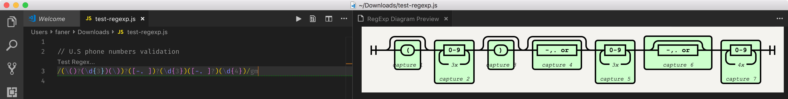
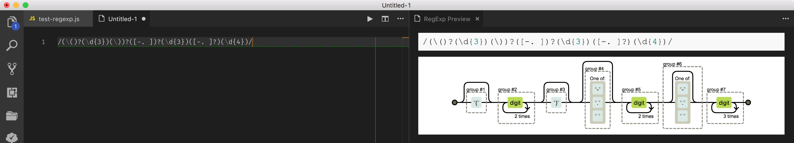
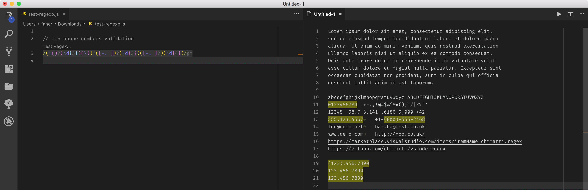

[Regular Expression](https://en.wikipedia.org/wiki/Regular_expression)  

A **regular expression**, **regex** or **regexp** (sometimes called a **rational expression**) is, in theoretical computer science and formal language theory, a sequence of characters that define a search [pattern](https://en.wikipedia.org/wiki/Pattern_matching). Usually this pattern is then used by [string searching algorithms](https://en.wikipedia.org/wiki/String_searching_algorithm) for "find" or "find and replace" operations on strings, or for input validation.

The concept arose in the 1950s when the American mathematician Stephen Cole Kleene formalized the description of a regular language. The concept came into common use with Unix text-processing utilities.

Since the 1980s, different syntaxes for writing regular expressions exist, one being the [POSIX](https://en.wikipedia.org/wiki/POSIX) standard and another, widely used, being the [Perl](https://en.wikipedia.org/wiki/Perl) syntax.

[**Regular-Expressions.info**](https://www.regular-expressions.info/) - The Premier website about Regular Expressions

## references

[正则表达式参考手册](http://harttle.land/2016/07/18/intro-to-regexp.html) - [PCRE表达式全集@wiki](https://zh.wikipedia.org/wiki/%E6%AD%A3%E5%88%99%E8%A1%A8%E8%BE%BE%E5%BC%8F)  
[正则表达式快速参考](https://ahkcn.github.io/docs/misc/RegEx-QuickRef.htm#%E6%AD%A3%E5%88%99%E8%A1%A8%E8%BE%BE%E5%BC%8F%EF%BC%88RegEx%EF%BC%89%E2%80%94%E2%80%94%E5%BF%AB%E9%80%9F%E5%8F%82%E8%80%83)  
[正则表达式30分钟入门教程](http://www.deerchao.net/tutorials/regex/regex.htm)  

[第 19 单元：正则表达式](https://www.ibm.com/developerworks/cn/java/j-perry-regular-expressions/index.html)  
MSDN [.NET 正则表达式](https://docs.microsoft.com/zh-cn/dotnet/standard/base-types/regular-expressions)  [快速参考](https://docs.microsoft.com/zh-cn/dotnet/standard/base-types/regular-expression-language-quick-reference)  

[RegEx Reference](https://regexr.com/)  

### perlre

[perlrequick](https://perldoc.perl.org/perlrequick.html)  
[perlre](https://perldoc.perl.org/perlre.html)  

### RegExp

[ecma262](https://tc39.github.io/ecma262/#sec-regexp-regular-expression-objects)  

w3: [en](https://www.w3schools.com/jsref/jsref_obj_regexp.asp) / [zh](http://www.w3school.com.cn/js/jsref_obj_regexp.asp)  
MDN: [en](https://developer.mozilla.org/en-US/docs/Web/JavaScript/Reference/Global_Objects/RegExp) / [zh](https://developer.mozilla.org/zh-CN/docs/Web/JavaScript/Reference/Global_Objects/RegExp)  
[liaoxuefeng](https://www.liaoxuefeng.com/wiki/001434446689867b27157e896e74d51a89c25cc8b43bdb3000/001434499503920bb7b42ff6627420da2ceae4babf6c4f2000) / [ruanyifeng](http://javascript.ruanyifeng.com/stdlib/regexp.html)

[Using Regular Expressions with JavaScript](https://www.regular-expressions.info/javascript.html)  
[The Little Guide for Regular Expressions in JS](https://hackernoon.com/guide-for-regular-expressions-in-js-2a33620ca1cf?gi=79aab414369a)  

[String & RegExp](https://github.com/fan2/web/blob/master/javascript/notes/String%26RegExp.md):

- `String.match(regexp)`：返回 RegExpMatchArray；  
- `String.search(regexp)`：返回 number 类型，第一个满足条件的匹配结果在整个字符串中的位置或 -1。  
- `String.replace(searchValue, replaceValue)`：替换源 searchValue 支持 RegExp 表达式；  
- `String.split(regexp)`：按照正则规则分割字符串，返回一个由分割后的各个部分组成的子串数组（`string[]`）；  

- `RegExp.test(string)`：测试字符串是否匹配模式；  
- `RegExp.exec(string)`：返回 RegExpMatchArray；  

#### expression

有两种书写正则表达式的方式：

1. Literal Expression: `let re = /pattern/flags`;  
2. Class RegExp: let re = `new RegExp('pattern', 'flags')`;  

- Use the **literal expression** when the regular expression is going to be ***constant***, because this way offers the immediate compilation of the regular expression when the script is loaded.  
- Use the **RegExp** constructor when the regular expressions is going to ***change*** or maybe the user is going to determinate the pattern.  

#### flags

`/g` enables "global" matching. 

> Is for global search. Meaning it’ll match all occurrences, not just the first.  
> When using the replace() method, specify this modifier to replace all matches, rather than only the first one.  

`/i` makes the regex match case insensitive.  

`/m` enables "multi-line mode", for multi-line searching.  

> In this mode, the caret and dollar match before and after newlines in the subject string.  

`y`: call Sticky, matches only from the index indicated by the lastIndex property of this regular expression. (not standard yet).  

**注意**：`/m` 多行匹配，将会影响 `^` 和 `$`。

### python

[re](https://docs.python.org/3/library/re.html?highlight=re#module-re) - Support for regular expressions (RE).

The sequence

```Python
prog = re.compile(pattern)
result = prog.match(string)
```

is equivalent to

```Python
result = re.match(pattern, string)
```

常用 API 如下：

`re.search(pattern, string, flags=0)`: 扫描整个字符串并返回 **第一个** 成功的匹配。  
`re.match(pattern, string, flags=0)`: 尝试从字符串的起始位置匹配一个模式，如果不是起始位置匹配成功的话就返回 None。  
`re.fullmatch(pattern, string, flags=0)`: 匹配整个字符串。  
`re.split(pattern, string, maxsplit=0, flags=0)`: 按照能够匹配的子串将字符串分割后返回列表。  
`re.findall(pattern, string, flags=0)`:  在字符串中找到正则表达式所匹配的所有子串，并返回一个列表，如果没有找到匹配的，则返回空列表。  

> 注意： match 和 search 是匹配 **一次**，findall 则是匹配 **所有**。

flags 可为 re.M, re.I, re.S。

## [standards](https://en.wikipedia.org/wiki/Regular_expression)

### [BRE](https://en.wikipedia.org/wiki/Regular_expression#POSIX_basic_and_extended)

基本的正则表达式（Basic Regular Expressions），又叫 Basic RegEx，简称 `BRE`。

### [ERE](https://en.wikipedia.org/wiki/Regular_expression#POSIX_extended)

扩展的正则表达式（Extended Regular Expressions），又叫 Extended RegEx，简称 `ERE`。

`BRE` and `ERE` work together.

**`BRE`** requires that the metacharacters `( )` and `{ }` be designated `\(\)` and `\{\}`, whereas Extended Regular Syntax (`ERE`) does not.  
***`ERE`*** adds **`?`**, **`+`**, and **`|`**, and it removes the need to escape the metacharacters `( )` and `{ }`, which are required in `BRE`.  

### [Perl and PCRE](https://en.wikipedia.org/wiki/Regular_expression#Perl_and_PCRE)

https://pcre.org/

Perl 的正则表达式（Perl Regular Expressions），又叫 Perl RegEx，简称 `PRE`。  
Perl 兼容格式的正则表达式（Perl Compatible Regular Expressions），简称 `PCRE`。  

[**PCRE**](https://en.wikipedia.org/wiki/Perl_Compatible_Regular_Expressions) is a library written in C, which implements a [regular expression](https://en.wikipedia.org/wiki/Regular_expression) engine, inspired by the capabilities of the [Perl programming language](https://en.wikipedia.org/wiki/Perl). Philip Hazel started writing PCRE in summer 1997. PCRE's syntax is much more powerful and flexible than either of the [POSIX regular expression](https://en.wikipedia.org/wiki/Regular_expression#POSIX) flavors and than that of many other regular-expression libraries.

Because of its expressive power and (relative) ease of reading, many other utilities and programming languages have **adopted** syntax similar to Perl's—for example, `Java`, `JavaScript`, `Python`, `Ruby`, `Qt`, `Microsoft's .NET Framework`, and `XML Schema`.

A number of prominent open-source programs, such as the Apache and Nginx HTTP Servers, and the PHP and R scripting languages, **incorporate** the PCRE library; proprietary software can do likewise, as the library is BSD licensed.

Perl 5.10 implements syntactic extensions originally developed in PCRE and Python.

## man regex

```obj-c
faner@MBP-FAN:~|⇒  man 7 re_format
faner@MBP-FAN:~|⇒  man 3 regex
faner@MBP-FAN:~|⇒  man grep
faner@MBP-FAN:~|⇒  man sed
```

### grep

`grep`, `egrep`, `fgrep` - print lines matching a pattern

the variant programs **`egrep`** and **`fgrep`** are the same as `grep -E` and `grep -F`, respectively.  
These variants are **deprecated**, but are provided for backward compatibility.  

以下为 `man grep` 的选项说明：

```shell
OPTIONS

   Generic Program Information
       --help Output a usage message and exit.

       -V, --version
              Output the version number of grep and exit.

   Matcher Selection
       -E, --extended-regexp
              Interpret PATTERN as an extended regular expression (ERE, see below).

       -F, --fixed-strings
              Interpret PATTERN as a list of fixed strings (instead of regular expressions), separated by newlines, any of which is to be matched.

       -G, --basic-regexp
              Interpret PATTERN as a basic regular expression (BRE, see below).  This is the default.

       -P, --perl-regexp
              Interpret the pattern as a Perl-compatible regular expression(PCRE).  This is experimental and grep -P may warn of unimplemented features.
```

默认选项是 `-G`(`--basic-regexp`)，即 **BRE**。  
如果要支持 **`?`**, **`+`** 和 **`|`**，则需要显式指定 `-E` 选项，即执行 **ERE**。

### [ripgrep](https://github.com/BurntSushi/ripgrep)

ripgrep recursively searches directories for a regex pattern

## regex online

[regexper](https://regexper.com/) - railroad  
[regexr](https://regexr.com/)  

[w3cschool](https://www.w3cschool.cn/regexp/6a7w1pr0.html)  
[chinaz](http://tool.chinaz.com/regex) / [oschina](http://tool.oschina.net/regex)  

## [cheatsheet](https://regexr.com/)

[**Regular expressions in Perl**](http://jkorpela.fi/perl/regexp.html)  
[Tables of Perl Regular Expression (PRX) Metacharacters](http://support.sas.com/documentation/cdl/en/lrdict/64316/HTML/default/viewer.htm#a003288497.htm)  

<table class="cheatsheet"> <tbody><tr><th colspan="2" data-id="charclasses">Character classes</th></tr> <tr><td><a>.</a></td><td>any character except newline</td></tr> <tr><td><a>\w</a>&ensp;<a>\d</a>&ensp;<a>\s</a></td><td>word, digit, whitespace</td></tr> <tr><td><a>\W</a>&ensp;<a>\D</a>&ensp;<a>\S</a></td><td>not word, digit, whitespace</td></tr> <tr><td><a>[abc]</a></td><td>any of a, b, or c</td></tr> <tr><td><a>[^abc]</a></td><td>not a, b, or c</td></tr> <tr><td><a>[a-g]</a></td><td>character between a &amp; g</td></tr> <tr><th colspan="2" data-id="anchors">Anchors</th></tr> <tr><td><a>^abc$</a></td><td>start / end of the string</td></tr> <tr><td><a>\b</a>&ensp;<a>\B</a></td><td>word, not-word boundary</td></tr> <tr><th colspan="2" data-id="escchars">Escaped characters</th></tr> <tr><td><a>\.</a>&ensp;<a>\*</a>&ensp;<a>\\</a></td><td>escaped special characters</td></tr> <tr><td><a>\t</a>&ensp;<a>\n</a>&ensp;<a>\r</a></td><td>tab, linefeed, carriage return</td></tr> <tr><th colspan="2" data-id="groups">Groups &amp; Lookaround</th></tr> <tr><td><a>(abc)</a></td><td>capture group</td></tr> <tr><td><a>\1</a></td><td>backreference to group #1</td></tr> <tr><td><a>(?:abc)</a></td><td>non-capturing group</td></tr> <tr><td><a>(?=abc)</a></td><td>positive lookahead</td></tr> <tr><td><a>(?!abc)</a></td><td>negative lookahead</td></tr> <tr><th colspan="2" data-id="quants">Quantifiers &amp; Alternation</th></tr> <tr><td><a>a*</a>&ensp;<a>a+</a>&ensp;<a>a?</a></td><td>0 or more, 1 or more, 0 or 1</td></tr> <tr><td><a>a{5}</a>&ensp;<a>a{2,}</a></td><td>exactly five, two or more</td></tr> <tr><td><a>a{1,3}</a></td><td>between one &amp; three</td></tr> <tr><td><a>a+?</a>&ensp;<a>a{2,}?</a></td><td>match as few as possible</td></tr> <tr><td><a>ab|cd</a></td><td>match ab or cd</td></tr> </tbody></table>

`(?:re)` 类似 `(…)`，匹配部分区块，但是不捕获存储为组。

例1: `industr(?:y|ies)`：非捕获匹配 industry|industries。  
例2：`/(?:^)\d{4}/m` 顶格匹配以四个数字开头的行。  

### 常用限定符

| 代码/语法 | 说明            |
| --------- | --------------- |
| ?         | 重复0次或1次    |
| +         | 重复1次或多次   |
| *         | 重复0次或多次   |
| {n}       | 重复n次         |
| {n,}      | 重复n次或更多次 |
| {n,m}     | 重复n到m次      |

`+` is equivalent to `{1,}`

### 常用元字符

| 代码 | 说明                                         |
| ---- | -------------------------------------------- |
| .    | 匹配除 `换行符` 以外的任意字符               |
| \w   | 匹配 `字母` 或 `数字` 或 `下划线`（word）    |
| \s   | 匹配任意的 `空白符`（space）                 |
| \d   | 匹配 `数字`（digit）                         |
| \b   | 匹配单词的 `开始` 或 `结束`（word boundary） |
| ^    | 匹配字符串的 `开始`                          |
| $    | 匹配字符串的 `结束`                          |

To match any character including newline, use a pattern such as `[.\n]`.

> Python 中对应 flag 为 `re.S`。

### 常用反义词

| 代码/语法 | 说明                                             |
| --------- | ------------------------------------------------ |
| \W        | 匹配任意 **不是** 字母，数字，下划线，汉字的字符 |
| \S        | 匹配任意 **不是** 空白符的字符                   |
| \D        | 匹配任意 **非** 数字的字符                       |
| \B        | 匹配 **不是** 单词开头或结束的位置               |
| [^x]      | 匹配除了 x 以外的任意字符                        |
| [^aeiou]  | 匹配除了 aeiou 这几个字母以外的任意字符          |

## vscode extensions

vscode 1.29.0 基于 [ripgrep](https://github.com/BurntSushi/ripgrep) 实现支持 multiline search。

vscode 默认是 `search.useRipgrep`（Deprecated），建议采用 **`search.usePCRE2`**，支持 [lookaround](https://www.regular-expressions.info/lookaround.html) 和 [backreferences](https://www.regular-expressions.info/backref.html) 等特性。

### [Regex Railroad Diagrams](https://marketplace.visualstudio.com/items?itemName=kogai.regex-railroad-diagrams)

> Display railroad diagram of regex under cursor.
>> A regular expression railroad diagram view for regular expression under cursor. This is inspired by [regex railroad diagrams](https://github.com/klorenz/atom-regex-railroad-diagrams).

光标定位到 js 文件中的正则表达式（RegExp）所在行，再在控制面板中执行 `Show RegExp preview` 命令，将在右侧新开辅助编辑器显示 `RegExp Diagram Preview`。



> 最新版 vscode 中不可用！

### [RegExp Preview and Editor](https://marketplace.visualstudio.com/items?itemName=le0zh.vscode-regexp-preivew)

> VSCode extension based on [regexper-static](https://github.com/javallone/regexper-static). Including regexp expression preivewer and realtime preivew editor.

在控制面板中执行 `RegExp Editor`，将打开左侧编辑器，可在其输入正则表达式，右侧的 `RegExp Preview` 将展开其匹配分解逻辑图。



> 最新版 vscode 中不可用，考虑安装 [Lulus Young](https://marketplace.visualstudio.com/items?itemName=Lulus.vscode-regexp-preivew) 或 [LouisWT](https://marketplace.visualstudio.com/items?itemName=LouisWT.regexp-preview) 适配的新版本！

### [Regex Previewer](https://marketplace.visualstudio.com/items?itemName=chrmarti.regex)

> Regex matches previewer for JavaScript, TypeScript, PHP and Haxe in Visual Studio Code.

新建一个 js 文件，该插件会自动检测其中的正则表达式，并在其上浮现 `Test Regex...` 提示条。  
点击或在控制面板中执行 `Toggle Regex Preview In Side-By-Side Editors` 命令将在右侧开启测试编辑器。  
在测试编辑器中输入测试字符串，再将光标移动到 js 中的正则表达式所在行，右侧将高亮匹配的文本。



> `/g` 标志匹配所有行，未加则只匹配第一行。

### [Filter Line](https://marketplace.visualstudio.com/items?itemName=everettjf.filter-line)

* By Input String  
* By Input **Regex**  
* By Not Contain Input String  
* By Not Match Input **Regex**  
* By Config File  

#### config

必须在当前文件所在根目录（即 vscode 打开的文件夹）下创建过滤配置文件。

1. 如果打开的是独立文件，不是以文件夹打开，则提示 `Can not locate workspace folder for current file`；  
2. 如果是以文件夹（`~/folder`）打开文件（`~/folder/subfolder/test.log`），执行 `Filter Line By Config File`，则提示 `Can not locate config file ~/folder/.vscode/filterline.json`。  

***Config file format type***

There are 3 format types. As they are so simple, I will not describe them here. Please visit the demo directly :

1. `stringlist`: String list [json](https://github.com/everettjf/vscode-filter-line/blob/master/demo/log0json/.vscode/filterline.json) or [eoml](https://github.com/everettjf/vscode-filter-line/blob/master/demo/log0eoml/.vscode/filterline.eoml)  
2. **`regexlist`**: Regular expressions list [json](https://github.com/everettjf/vscode-filter-line/blob/master/demo/log1json/.vscode/filterline.json) or [eoml](https://github.com/everettjf/vscode-filter-line/blob/master/demo/log1eoml/.vscode/filterline.eoml)  
3. `general`: This is default if type is not specified. [json](https://github.com/everettjf/vscode-filter-line/blob/master/demo/log2json/.vscode/filterline.json) or [eoml](https://github.com/everettjf/vscode-filter-line/blob/master/demo/log2eoml/.vscode/filterline.eoml)  
