## Charles

<http://www.charlesproxy.com/>

Charles is an HTTP proxy / HTTP monitor / Reverse Proxy that enables a developer to view all of the HTTP and SSL / HTTPS traffic between their machine and the Internet. This includes requests, responses and the HTTP headers (which contain the cookies and caching information).

Charles 通过将自己设置成系统的网络访问代理服务器，使得所有的网络访问请求都通过它来完成，从而实现了网络封包的截取和分析。

## 基本使用

首次启动 Charles，将会弹窗提示请求授予系统代理权限：

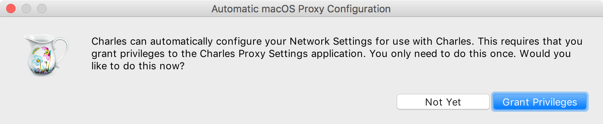

如果点击 `Not Yet`，暂时不授权，则后续可通过菜单 `Proxy` 中开启 `macOS Proxy`。

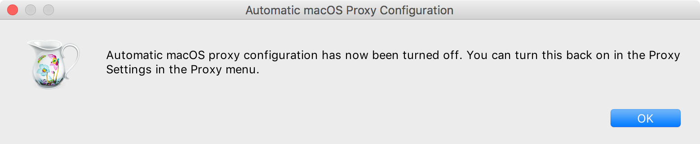

如果点击 `Grant Privileges`，将弹窗提示输入系统密码授权：

授权成功后，菜单 `Proxy | macOS Proxy` 呈勾选状态：

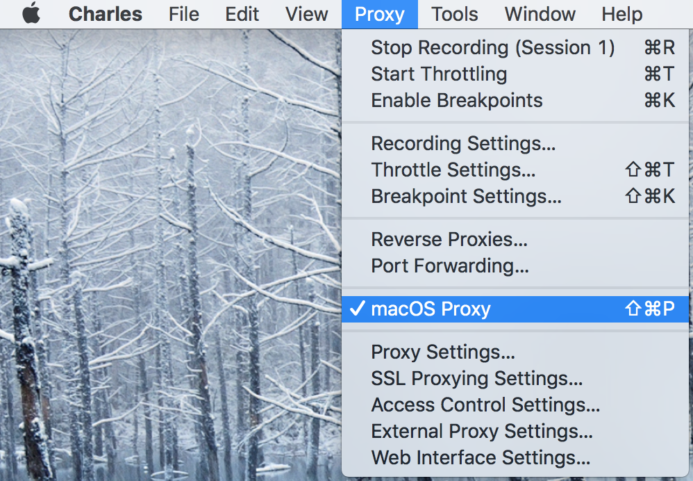

在系统偏好设置 网络设置 - 代理 中，Charles 将自己设置为 HTTP 和 HTTPS 代理：

- 网页代理（HTTP）：127.0.0.1 : 8888  
- 安全网页代理（HTTPS） 127.0.0.1 : 8888  

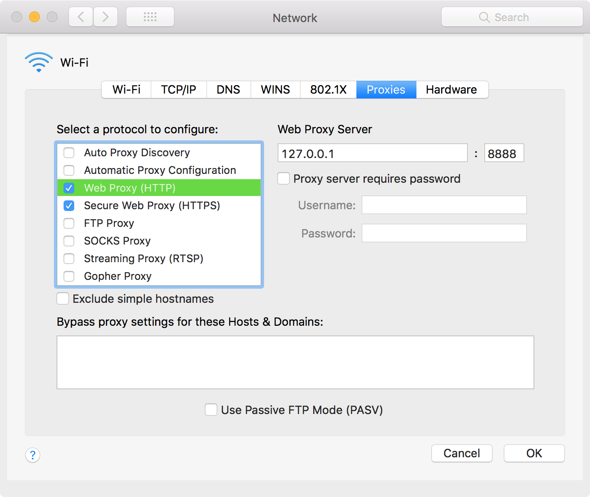

由于 macOS 下的浏览器（Safari & Chrome）等应用默认使用系统网络代理。

> The proxy server you set here will be used by Apple Safari, Google Chrome, and other applications that [respect your system proxy settings](https://www.howtogeek.com/293444/how-to-configure-a-proxy-server-on-a-mac/).

至此，Charles 已经在抓取 Chrome 访问的所有 HTTP 和 HTTPS 请求。

有些应用会忽略系统代理设置，导致包不走 [Charles](https://www.v2ex.com/t/359073) 代理，无法抓取。 此时，Android 下可用 [ProxyDroid](https://blog.csdn.net/codezjx/article/details/8872090) 强制[全局代理](https://blog.csdn.net/codezjx/article/details/8872071)。

---

退出关闭 Charles 时，将会自动恢复之前系统网络设置中的 HTTP 和 HTTPS 代理配置。

---

下次重启 Charles 时，需要到菜单 `Proxy` 中下拉选中 `macOS Proxy`，将 Charles 作为 macOS 系统代理。

## 偏好设置

### Launch

在 Charles Preferences 的 **Launch** 中，默认勾选了 `Open a new session`：

- [x] Open a new session

这会导致启动 Charles 时，默认开启会话（Session 1），并且开始记录（Recording）。

可反勾选 **Launch** 中的 `Open a new session`，这样每次启动就不会自动开启抓包。

后续启动 Charles，需要先到菜单中勾选 `Proxy | macOS Proxy`，再 `File | New Session` 开启会话抓包。

### Viewers

- [x] Combine header and body viewers  
- [x] Combine request and response  

可以按需反选以上两项配置。

## 显示列

Charles 默认有以下显示列：

1. Response Code   
2. Method  
3. Host  
4. Path  
5. Request Start Time   
6. Duration  
7. Size  
8. Status  
9. Info  

可右键列标题栏，选择添加修改为以下列显：

1. Start  
2. Client IP  
3. Client Port  
4. Remote IP  
5. Remote Port  
6. Protocol  
7. Method  
8. Host  
9. Path  
10. Code  
11. Duration  
12. Req Size  
13. Resp Size  
14. Status  

## 过滤网络请求

启动 Charles 默认开始抓取活动网卡的所有 HTTP 通信包。可以在 `Filter` 中设置关键字，过滤出想要的目标通信包。

如果只向抓获目标网站的封包，则可以到菜单 `Proxy | Recording Settings` 的 include 中配置想要过滤的目标。

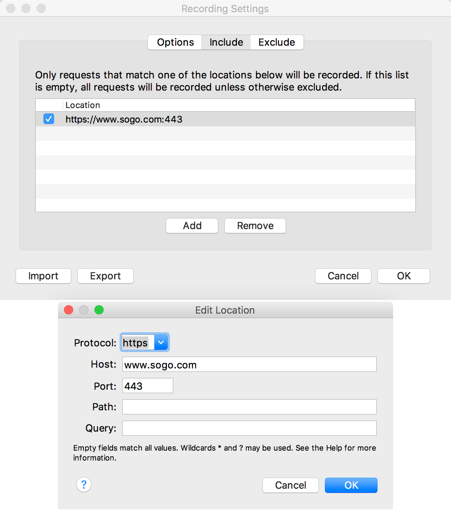

## HTTPS（SSL代理）

访问[搜狗首页](https://www.sogo.com/)，Charles 抓包如下：

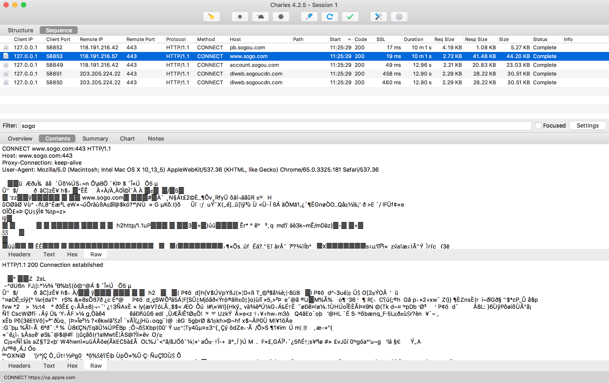

Notes 提示 `SSL Proxying not enabled for this host: enable in Proxy Settings, SSL locations`：

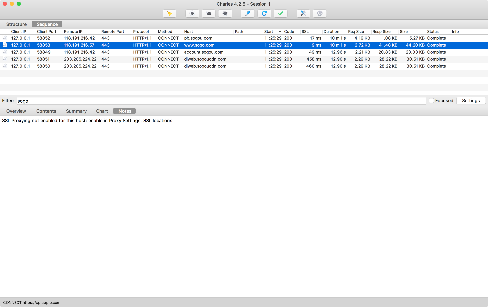

通过菜单 `Help | SSL Proxying | Install Charles Root Certificate` 安装 Charles 的 CA 根证书。

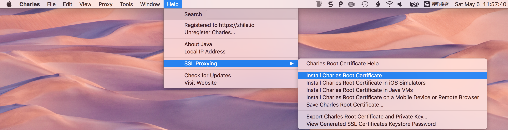

系统弹窗提示新根证书需要手动添加到 登录 的 证书 类别中：

点击 OK 后，如果 Keychain Access 的 登录-证书 中没有 Charles Proxy CA，则再执行一次 `Help | SSL Proxying | Install Charles Root Certificate`。

提示 **证书不受信任**：

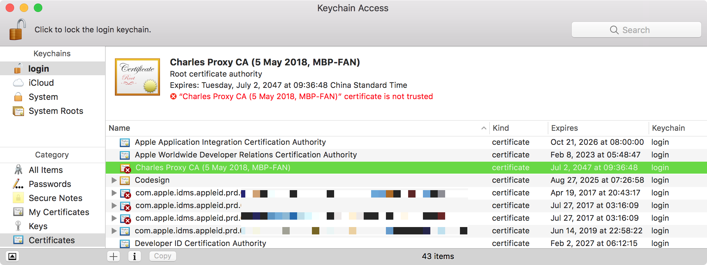

双击该证书，展开 Trust，将 When using this certificate 默认策略 Use System Defaults 改为 Always Trust。

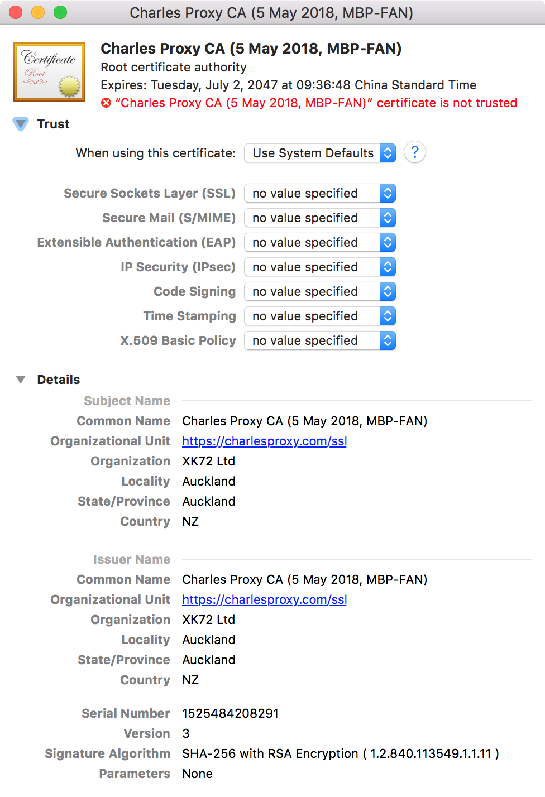

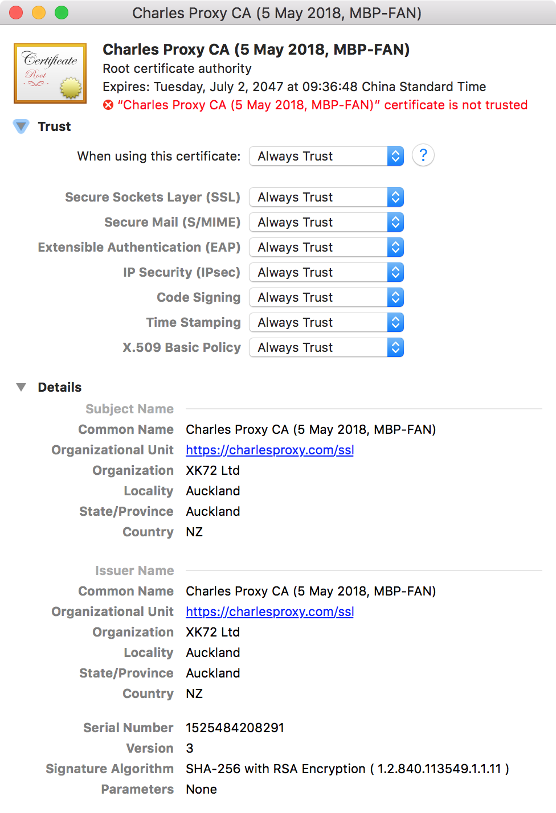

系统弹窗密码授权更改证书信任配置：

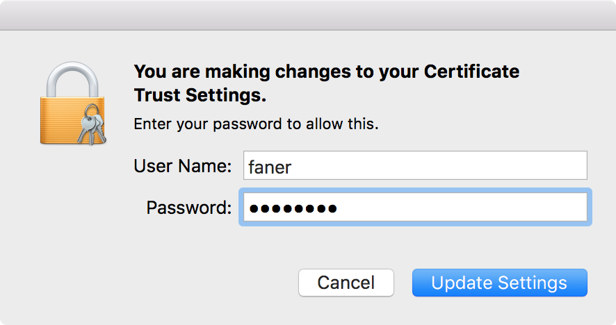

输入密码后，Charles Proxy CA 已置于信任状态：

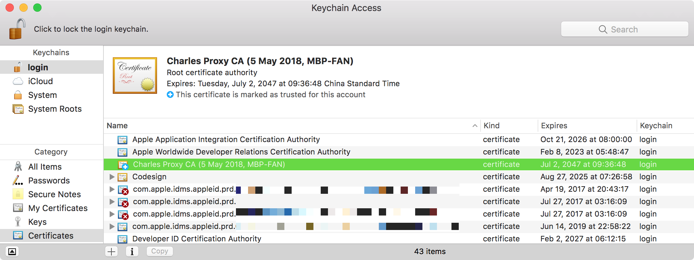

回到抓包会话窗口，右击 www.sogo.com 行，勾选 `Enable SSL Proxying` 将启用 SSL 代理：

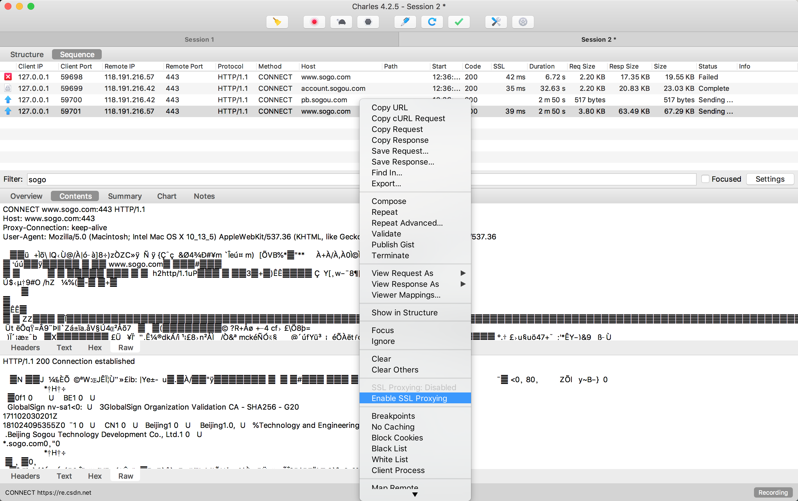

再次访问 <https://www.sogo.com/> ，则 Charles 代理了 HTTPS（SSL） 访问，可抓取解密后的 HTTP 报文：

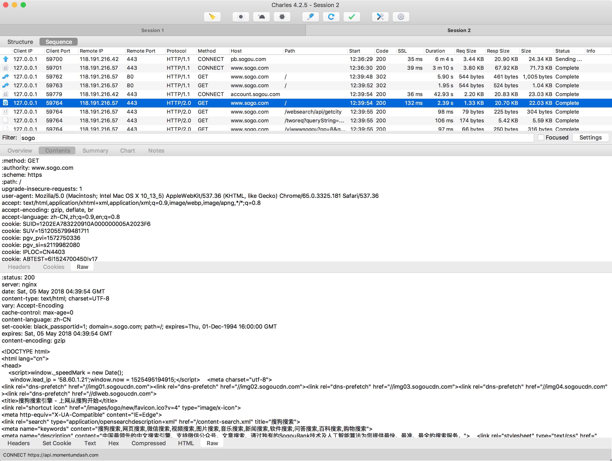

## 移动端

### 抓取移动端的 HTTP 包

#### Charles 上的设置

要截取 iPhone 上的网络请求，我们首先需要将 Charles 的代理功能打开。
其次，在 Charles 的菜单 `Proxy | Proxy Settings` 上填入代理端口 8888，并且勾上 `Enable transparent HTTP proxying`。

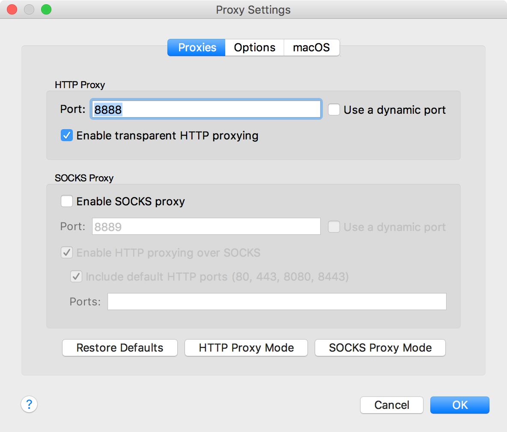

#### iPhone 上的设置

通过 Charles 菜单 `Help | Local IP Address` 可查看 Charles 所在机器（macOS）的IP地址。

在 iPhone 设置 | 无线局域网 中点击进入和 macOS 连接的相同局域网 WiFi 右侧的 `i` 图标，进入网络连接详情页。

点击 **配置代理**，进入选择 **手动**，服务器填写 macOS(Charles) 的 IP 地址；端口号填写 8888。

打开 iPhone 上的任意需要网络通讯的程序，就可以看到 Charles 弹出 iPhone 请求连接的确认菜单（如下图所示），点击 “Allow” 即可完成设置。

### 抓取移动端的 HTTPS 包

如果要截取移动设备中的 HTTPS 通讯信息，则需要在 iOS 或 Android 机器上截取 HTTPS 协议的通讯内容，还需要在手机上安装相应的证书。

点击 Charles 的顶部菜单，选择 `Help | SSL Proxying | Install Charles Root Certificate on a Mobile Device or Remote Browser`，然后就可以看到 Charles 弹出的安装提示。

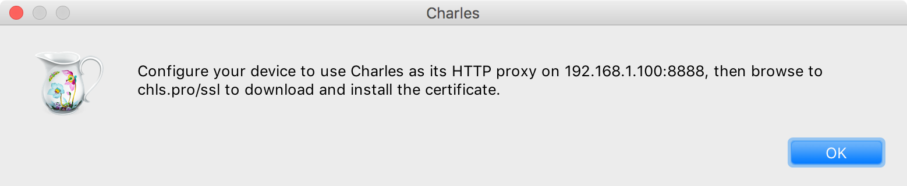

1. 设置 iPhone/Android 的 HTTP 代理为 `192.168.1.100:8888`；  
2. 然后在 iPhone/Android 上访问 <http://chls.pro/ssl> 下载安装证书（`charles-proxy-ssl-proxying-certificate.pem`）。  
