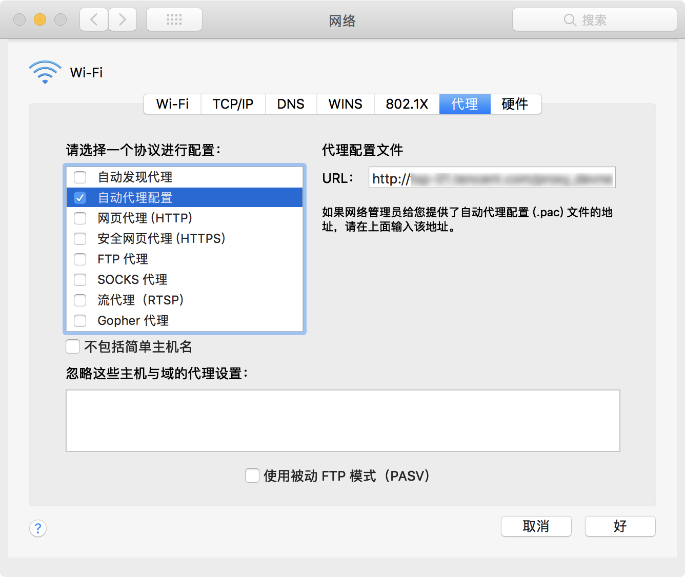
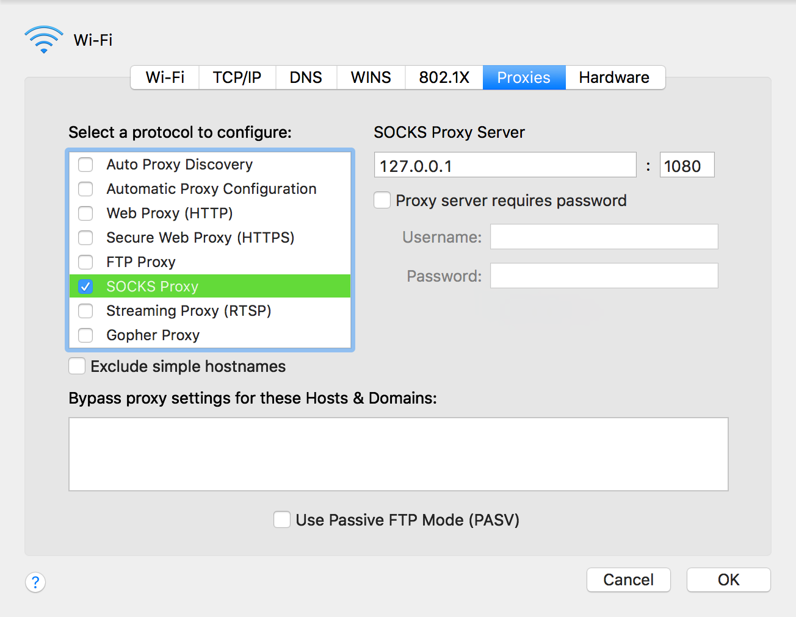
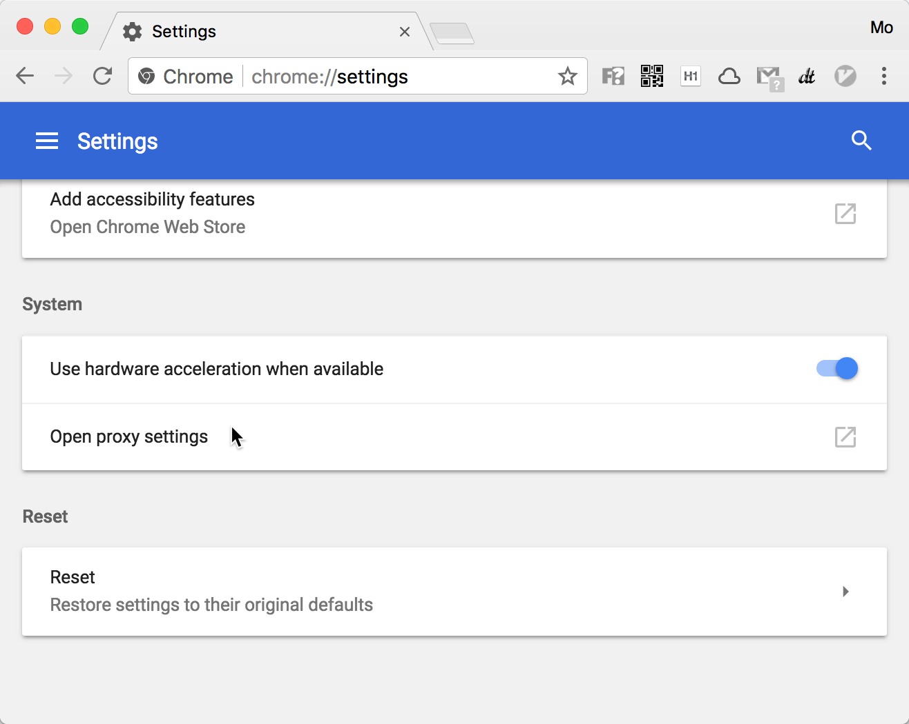
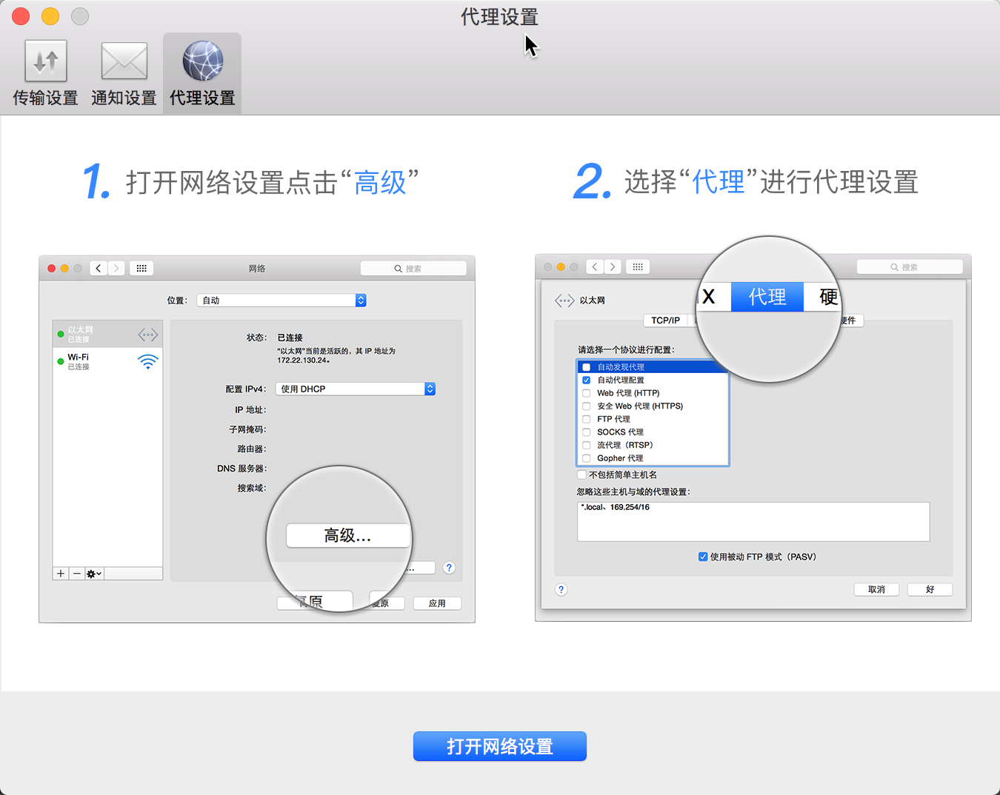
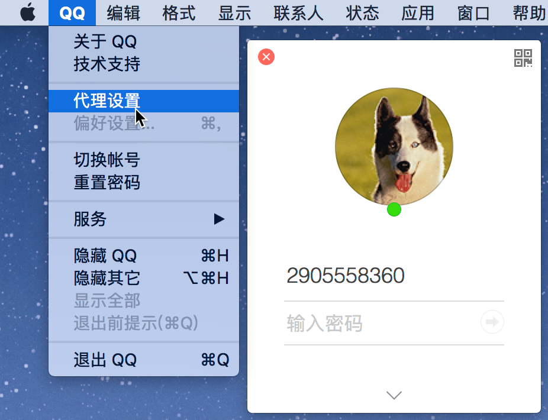
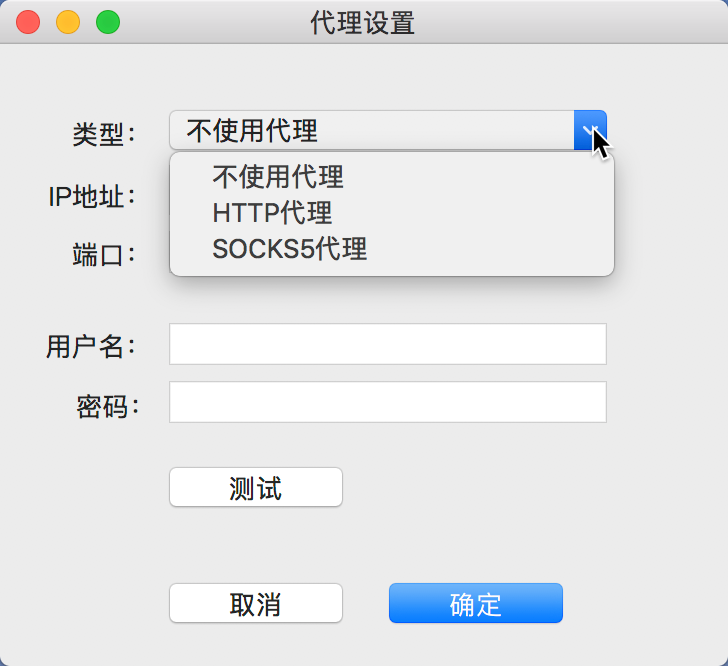

## 代理原理
[Socks代理和http代理的区别](https://wrfly.kfd.me/SOCKS%E4%BB%A3%E7%90%86%E5%92%8CHTTP%E4%BB%A3%E7%90%86%E7%9A%84%E5%8C%BA%E5%88%AB/)  

### HTTP PROXY
[**HTTP代理原理探索**](http://blog.csdn.net/cszhouwei/article/details/74354166)  
HTTP 代理原理及实现（[一](https://imququ.com/post/web-proxy.html)）（[二](https://imququ.com/post/web-proxy-2.html)）

[npm 那些事儿](https://www.jianshu.com/p/e8755bfbf8f4)  

[20分钟掌握前端编写 CLI 工具](https://cloud.tencent.com/developer/article/1005105)  

爬虫实战 : 爬虫之 web 自动化终极杀手：[上](https://www.qcloud.com/community/article/759574) / [下](https://www.qcloud.com/community/article/565333)  

### [socks](https://en.wikipedia.org/wiki/SOCKS)
[RFC 1928 - SOCKS Protocol Version 5](https://www.ietf.org/rfc/rfc1928.txt)  

[SOCKS5协议原理](http://www.cppblog.com/noflybird/archive/2009/12/26/104149.html)  
[**SOCKS5代理原理探索**](http://blog.csdn.net/cszhouwei/article/details/74362427)  
[BadVPN详解之--始记:透明socks代理与tun2socks](http://blog.csdn.net/dog250/article/details/70343230)  

[设置socks5代理](https://www.jianshu.com/p/ff4093ed893f)  

## Windows 设置代理
Windows 下的 **Internet 选项** 可设置全局代理？

[Windows 下如何全局走 socks？](https://www.v2ex.com/t/184543)  
[shadowsocks-windows](https://github.com/shadowsocks/shadowsocks-windows)  

- [Win7 64位系统全局代理所有程序都有效?](https://github.com/shadowsocks/shadowsocks-windows/issues/530)  
- [windows终端命令行下如何使用代理？](https://github.com/shadowsocks/shadowsocks-windows/issues/1489)  

> SS 全局代理只针对使用 IE 代理的程序才全局，不是像 VPN 那样的全局，要实现VPN那样的功能，要用Proxifier。  

### Internet 

### cmd
```shell
set http_proxy=http://host:port
set https_proxy=http://host:port
```

Window 没有这个环境变量，要到 IE 设置 或 控制面板 中的 **Internet 选项** 里设置代理？

Windows cmd 代理：[设置](http://blog.csdn.net/lovelyelfpop/article/details/69586366) 与 [取消](http://jinbitou.net/2017/09/21/2534.html)  
[CMD 和 Git 中的代理设置](http://www.cnblogs.com/terrylin/p/3296428.html)  
[如何对windows的命令行设置代理IP？](https://www.zhihu.com/question/23059121)  
[windows环境下设置命令行CMD、Git、NPM和Bowser代理设置](http://www.it610.com/article/5167917.htm)  

## macOS 设置代理
在 macOS 的 `系统偏好设置-网络-高级-代理` 中可[设置代理](https://support.apple.com/kb/PH25424?locale=zh_CN)。

  



> [**How to Configure a Proxy Server on a Mac**](https://www.howtogeek.com/293444/how-to-configure-a-proxy-server-on-a-mac/)  

### networksetup
系统网络管理命令 networksetup：

```shell
# man networksetup
NETWORKSETUP(8)           BSD System Manager's Manual          NETWORKSETUP(8)

NAME
     networksetup -- configuration tool for network settings in System Preferences.
```

执行 `networksetup -printcommands` 可查看 networksetup 子命令。

执行 `networksetup -help` 可查看子命令的帮助信息（Display these help listings）：

```shell
# networksetup -help

# 按顺序列举设备信息（Hardware Port、Device）
Usage: networksetup -listnetworkserviceorder
    Display services with corresponding port and device in order they are tried for connecting
    to a network. An asterisk (*) denotes that a service is disabled.

# 设备 Hardware Port 列表，作为其他命令的 <networkservice> 参数
Usage: networksetup -listallnetworkservices
	Display list of services. An asterisk (*) denotes that a network service is disabled.

# 列举设备信息（Hardware Port、Device、Ethernet Address），例如无线网卡信息：`Hardware Port: Wi-Fi Device: en0`
Usage: networksetup -listallhardwareports
	Display list of hardware ports with corresponding device name and ethernet address.

# 获取具体某个设备的网络连接信息
Usage: networksetup -getinfo <networkservice>
	Display IPv4 address, IPv6 address, subnet mask,
	router address, ethernet address for <networkservice>.

# 获取具体某个设备的 DNS 服务器信息
Usage: networksetup -getdnsservers <networkservice>
	Display DNS info for <networkservice>.

# 为某个设备设置 DNS 服务器
Usage: networksetup -setdnsservers <networkservice> <dns1> [dns2] [...] 
	Set the <networkservice> DNS servers to <dns1> [dns2] [...]. Any number of dns servers can be
	specified. Specify "Empty" for <dns1> to clear all DNS entries.

Usage: networksetup -getnetworkserviceenabled <networkservice>
    Display whether a service is on or off (enabled or disabled).

Usage: networksetup -setnetworkserviceenabled <networkservice> <on off>
    Set <networkservice> to either <on> or <off> (enabled or disabled).

Usage: networksetup -getMTU <hardwareport or device name>
    Get the MTU value for hardwareport or device specified.

Usage: networksetup -setMTU <hardwareport or device name> <value>
    Set MTU for hardwareport or device specified.

Usage: networksetup -listvalidMTUrange <hardwareport or device name>
    List the valid MTU range for hardwareport or device specified.

```

#### networkservices
查看本机安装的设备硬件端口和名称：

```shell
# 列举设备，只查看设备的 Hardware Port 信息
faner@THOMASFAN-MB0:~|⇒  networksetup -listallnetworkservices
An asterisk (*) denotes that a network service is disabled.
USB-Serial Controller
Wi-Fi
Thunderbolt Bridge
Thunderbolt Ethernet
Bluetooth PAN

# 列举设备，查看设备的 Hardware Port 和 Device 信息
faner@THOMASFAN-MB0:~|⇒  networksetup -listnetworkserviceorder
An asterisk (*) denotes that a network service is disabled.
(1) USB-Serial Controller
(Hardware Port: USB-Serial Controller, Device: usbserial)

(2) Wi-Fi
(Hardware Port: Wi-Fi, Device: en0)

(3) Thunderbolt Bridge
(Hardware Port: Thunderbolt Bridge, Device: bridge0)

(4) Thunderbolt Ethernet
(Hardware Port: Thunderbolt Ethernet, Device: en5)

(5) Bluetooth PAN
(Hardware Port: Bluetooth PAN, Device: en3)
```

#### proxy
执行 `networksetup -help | grep proxy` 可查看代理相关的操作接口。

```shell
# Auto Proxy Discovery
## 获取`自动发现代理`的开关状态
Usage: networksetup -getproxyautodiscovery <networkservice>
    Display whether Proxy Auto Discover is on or off for <network service>.

## 设置`自动发现代理`的开关
Usage: networksetup -setproxyautodiscovery <networkservice> <on off>
    Set Proxy Auto Discovery to either <on> or <off>.

# Automatic Proxy Configuration
## 设置`自动代理配置`的URL
Usage: networksetup -setautoproxyurl <networkservice> <url>
    Set proxy auto-config to url for <networkservice> and enable it.

## 获取`自动代理配置`的URL
Usage: networksetup -getautoproxyurl <networkservice>
    Display proxy auto-config (url, enabled) info for <networkservice>.

## 设置`自动代理配置`的开关
Usage: networksetup -setautoproxystate <networkservice> <on off>
    Set proxy auto-config to either <on> or <off>.

# Web Proxy(HTTP)
## 获取`网页代理(HTTP)`配置信息
Usage: networksetup -getwebproxy <networkservice>
    Display Web proxy (server, port, enabled value) info for <networkservice>.

## 设置`网页代理(HTTP)`信息
Usage: networksetup -setwebproxy <networkservice> <domain> <port number> <authenticated> <username> <password>
    Set Web proxy for <networkservice> with <domain> and <port number>. Turns proxy on. Optionally, specify <on> or <off> for <authenticated> to enable and disable authenticated proxy support. Specify <username> and <password> if you turn authenticated proxy support on.

## 设置`网页代理(HTTP)`的开关
Usage: networksetup -setwebproxystate <networkservice> <on off>
    Set Web proxy to  either <on> or <off>.

# Secure Web Proxy(HTTPS)
## 获取`安全网页代理(HTTPS)`配置信息
Usage: networksetup -getsecurewebproxy <networkservice>
    Display Secure Web proxy (server, port, enabled value) info for <networkservice>.

## 设置`安全网页代理(HTTPS)`信息
Usage: networksetup -setsecurewebproxy <networkservice> <domain> <port number> <authenticated> <username> <password>
    Set Secure Web proxy for <networkservice> with <domain> and <port number>. Turns proxy on. Optionally, specify <on> or <off> for <authenticated> to enable and disable authenticated proxy support. Specify <username> and <password> if you turn authenticated proxy support on.

## 设置`安全网页代理(HTTPS)`开关
Usage: networksetup -setsecurewebproxystate <networkservice> <on off>
    Set SecureWeb proxy to  either <on> or <off>.

# SOCKS Proxy
## 获取`SOCKS 代理`配置信息
Usage: networksetup -getsocksfirewallproxy <networkservice>
    Display SOCKS Firewall proxy (server, port, enabled value) info for <networkservice>.

## 设置`SOCKS 代理`信息
Usage: networksetup -setsocksfirewallproxy <networkservice> <domain> <port number> <authenticated> <username> <password>
    Set SOCKS Firewall proxy for <networkservice> with <domain> and <port number>. Turns proxy on. Optionally, specify <on> or <off> for <authenticated> to enable and disable authenticated proxy support. Specify <username> and <password> if you turn authenticated proxy support on.

## 设置`SOCKS 代理`开关
Usage: networksetup -setsocksfirewallproxystate <networkservice> <on off>
    Set SOCKS Firewall proxy to  either <on> or <off>.

```

执行 `networksetup -getautoproxyurl Wi-Fi` 查看无线网卡（Wi-Fi）的 `自动代理配置` 的 URL 信息：

```shell
faner@THOMASFAN-MB0:~|⇒  networksetup -getautoproxyurl Wi-Fi
URL: http://<host>:<port>/proxy.pac
Enabled: Yes
```

执行 `networksetup -getsocksfirewallproxy Wi-Fi` 查看无线网卡（Wi-Fi）的 `SOCKS 代理` 信息：

```shell
# 获取 SOCKS 代理
faner@THOMASFAN-MB0:~|⇒  networksetup -getsocksfirewallproxy Wi-Fi
Enabled: Yes
Server: 127.0.0.1
Port: 1080
Authenticated Proxy Enabled: 0
```

### 浏览器代理
> The proxy server you set here will be used by Apple Safari, Google Chrome, and other applications that [respect your system proxy settings](https://www.howtogeek.com/293444/how-to-configure-a-proxy-server-on-a-mac/).  

macOS 下的浏览器（Safari & Chrome）等应用默认遵循系统偏好设置中的代理配置。  

- 在 Safari -高级-代理 中点击 **更改设置**，将跳转到 `系统偏好设置-网络-高级-代理`。  

	

	> [How to set up proxy on Safari for Mac](https://www.cactusvpn.com/tutorials/how-to-set-up-proxy-on-safari-for-mac/)

- 在 Chrome - 设置 - 高级 打开**代理设置**，也是跳转到 `系统偏好设置-网络-高级-代理`。  

	

	> [Debugging problems with the network proxy](https://www.chromium.org/developers/design-documents/network-stack/debugging-net-proxy)  
	> [Change proxy settings for Chrome and not for entire operating system](https://apple.stackexchange.com/questions/244711/change-proxy-settings-for-chrome-and-not-for-entire-operating-system)  
	> [SOCKS5 proxy with ssh tunnel and chrome in OSX](https://keksi.io/tutorials/2017/02/08/socks5-proxy-with-ssh-and-chrome-in-osx/)  

### 终端设置代理
[Setting proxy via http_proxy on Mac](https://superuser.com/questions/384398/setting-proxy-via-http-proxy-on-mac)  
[How to set proxy on OS X Terminal permanently?](https://apple.stackexchange.com/questions/226544/how-to-set-proxy-on-os-x-terminal-permanently)  
[Mac OS X Network Proxy Settings in Terminal](https://dmorgan.info/posts/mac-network-proxy-terminal/)  

[**让终端走代理的几种方法**](https://blog.fazero.me/2015/09/15/%E8%AE%A9%E7%BB%88%E7%AB%AF%E8%B5%B0%E4%BB%A3%E7%90%86%E7%9A%84%E5%87%A0%E7%A7%8D%E6%96%B9%E6%B3%95/)  
[**MAC OS X 下怎么设置 Terminal 代理**](https://www.v2ex.com/t/249079)  

1. proxychains4+sslocal  
2. `export all_proxy=socks5://127.0.0.1:1080`  

### brew 设置代理
以下为 `man brew` 的 *`USING HOMEBREW BEHIND A PROXY`* 章节：

```shell
USING HOMEBREW BEHIND A PROXY
       Homebrew uses several commands for downloading files (e.g. curl, git, svn). Many of these tools can download
       via a proxy. It's common for these tools to read proxy parameters from environment variables.

       For  the  majority of cases setting http_proxy is enough. You can set this in your shell profile, or you can
       use it before a brew command:


           http_proxy=http://<host>:<port> brew install foo


       If your proxy requires authentication:


           http_proxy=http://<user>:<password>@<host>:<port> brew install foo

```

**方法1**：每次执行 brew 命令之前设置 http 和 https 代理

```shell
export http_proxy="http://<host>:<port>"
export https_proxy="http://<host>:<port>"
```

**方法2**：简单点写设置 ALL_PROXY 变量

```shell
export ALL_PROXY=http://<host>:<port>
```

> 也可将以上添加到 bash profile(`.bashrc`) 或者 zsh profile(`.zshrc`) 中。

### Sublime Text 设置代理


### [设置git使用socks5代理](https://gist.github.com/bluethon/45766d0a4541ab633e32a49b6c4e4bdd)

```shell
git config --global http.proxy 'socks5://127.0.0.1:1080'
git config --global https.proxy 'socks5://127.0.0.1:1080'
```

### 其他应用代理

> Some applications, including Mozilla Firefox, can have their own custom proxy settings independent from your system settings.

mac百度网盘代理设置：



macQQ代理设置：

  
  

## SSH Proxy

[SecureCRT 设置 HTTP 代理访问 SSH 服务器](http://blog.csdn.net/ChunPIG/article/details/8469281)  
[xShell 设置 HTTP 代理访问 SSH 服务器](http://blog.netsarang.com/87/connecting-through-http-proxy-server/)  

## Proxifier
> [Browsers do not support Socks proxy authorization](https://thesafety.us/proxy-setup-chrome-macos). In such cases it is necessary to use a special program. For example, Proxifier.  

### Proxifier
[Proxifier](http://www.proxifier.com/) - [Windows下的全局代理软件](https://www.linzhihao.cn/archives/976/) - 亦支持 macOS  
[ProxyCap](http://www.proxycap.com/) - [另一个Windows下的全局代理软件](https://www.linzhihao.cn/archives/978/) - 亦支持 macOS  

[Proxifier——让window全局代理](https://www.lingbaoboy.com/archives/510.html)  
[Proxifier实现全局代理（Windows）](http://www.leesven.com/5028.html)  
[让windows所有软件通过代理上网——Proxifier](https://www.douban.com/note/183877949/)  
[configuring Proxifier in Mac OS](https://thesafety.us/proxy-setup-proxifier-macos)  
[**Shadowshocks+Proxifier 系统全局代理的正确姿势**](http://blackwolfsec.cc/2016/09/19/Proxifier_Shadowshocks/)  

```shell
faner@THOMASFAN-MB0:~|⇒  brew cask search proxifier
==> Exact Match
caskroom/cask/proxifier

faner@THOMASFAN-MB0:~|⇒  brew cask info proxifier  
proxifier: 2.21
https://www.proxifier.com/mac/
Not installed
From: https://github.com/phinze/homebrew-cask/blob/master/Casks/proxifier.rb
==> Name
Proxifier
==> Artifacts
Proxifier.app (App)

faner@THOMASFAN-MB0:~|⇒  brew cask audit proxifier
audit for proxifier: passed
```

### [privoxy](https://www.privoxy.org/)
[OpenWrt wiki](https://wiki.openwrt.org/doc/howto/proxy.privoxy)  
[ss-local + privoxy 代理](https://www.zfl9.com/ss-local.html)  
[如何用 Privoxy 辅助翻墙？](https://program-think.blogspot.com/2014/12/gfw-privoxy.html)  

```shell
faner@THOMASFAN-MB0:~|⇒  brew search privoxy
==> Searching local taps...
privoxy
==> Searching taps on GitHub...
==> Searching blacklisted, migrated and deleted formulae...

faner@THOMASFAN-MB0:~|⇒  brew info privoxy  
privoxy: stable 3.0.26 (bottled)
Advanced filtering web proxy
https://www.privoxy.org/
Not installed
From: https://mirrors.ustc.edu.cn/homebrew-core.git/Formula/privoxy.rb
==> Dependencies
Build: autoconf ✘, automake ✘, libtool ✘
Required: pcre ✔
==> Caveats
To have launchd start privoxy now and restart at login:
  brew services start privoxy
Or, if you don't want/need a background service you can just run:
  privoxy /usr/local/etc/privoxy/config
```

### proxychains
[proxychains](https://github.com/haad/proxychains)  
[proxychains-ng](https://github.com/rofl0r/proxychains-ng) - Newer Generation  

[大学霸 Kali Linux 安全渗透教程](https://www.gitbook.com/book/wizardforcel/daxueba-kali-linux-tutorial) - [设置ProxyChains](https://wizardforcel.gitbooks.io/daxueba-kali-linux-tutorial/content/11.html)  
[用proxychains-ng为程序设置代理](https://www.52os.net/articles/proxychains-ng-redirect-tcp-to-proxy.html) @[简书](https://www.jianshu.com/p/9125637e7aec)   
[通过ProxyChains-NG实现终端下任意应用代理](https://www.hi-linux.com/posts/48321.html)  
[利用proxychains在终端使用socks5代理](https://blog.fazero.me/2015/08/31/%E5%88%A9%E7%94%A8proxychains%E5%9C%A8%E7%BB%88%E7%AB%AF%E4%BD%BF%E7%94%A8socks5%E4%BB%A3%E7%90%86/)  
[proxychains+shadowsocks神器](http://shawnelee88.github.io/2015/07/10/proxychains-shadowsocks%E7%A5%9E%E5%99%A8/)  

```shell
faner@THOMASFAN-MB0:~|⇒  brew search proxychains
==> Searching local taps...
proxychains-ng
==> Searching taps on GitHub...
==> Searching blacklisted, migrated and deleted formulae...

faner@THOMASFAN-MB0:~|⇒  brew info proxychains-ng
proxychains-ng: stable 4.12 (bottled), HEAD
Hook preloader
https://sourceforge.net/projects/proxychains-ng/
Not installed
From: https://mirrors.ustc.edu.cn/homebrew-core.git/Formula/proxychains-ng.rb
```