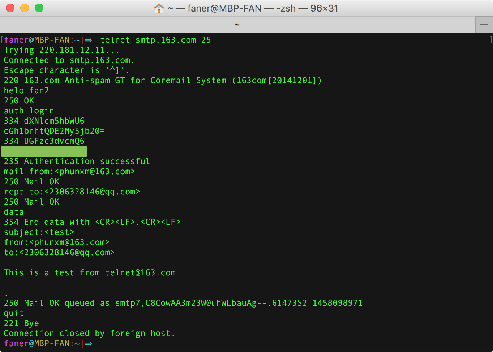
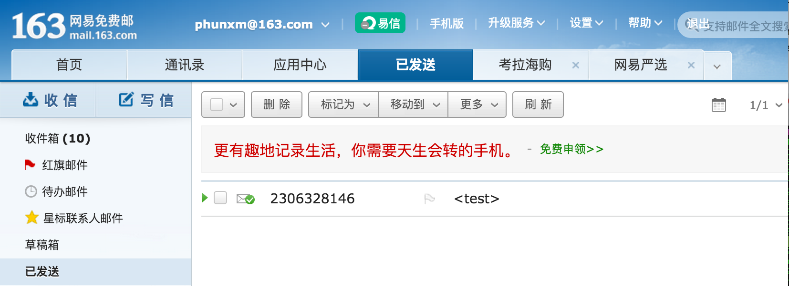
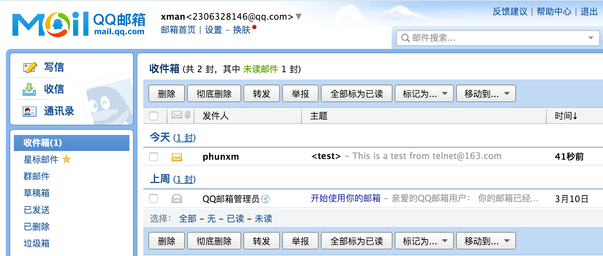

[telnet登录smtp发送邮件](http://coolnull.com/3055.html)

## telnet SMTP 服务器

```
⇒  telnet smtp.163.com 25
```

TCP 连接 `smtp.163.com:25`，应答码 `220` 表示连接成功（Service Ready）。

## helo 表明发送方身份
helo 命令发送机器名，表明自身身份（Sender's host name）。可随意填写。

回包 `250 OK`，表示 helo 发送成功。

## auth login 登录
输入 `auth login` 后会出现 `334 dXNlcm5hbWU6` 和 `334 UGFzc3dvcmQ6`，在 Mac OS X 终端中通过 `base64 -D` 命令解码可知，它们分别是 `username` 和 `Password` 的 BASE64 编码：

```
faner@MBP-FAN:~|⇒  echo dXNlcm5hbWU6 | base64 -D
username:%
faner@MBP-FAN:~|⇒  echo UGFzc3dvcmQ6 | base64 -D
Password:%
```

### 计算邮箱账户和密码的 BASE64 编码

```
faner@MBP-FAN:~|⇒  echo -n phunxm@163.com | base64
cGh1bnhtQDE2My5jb20=
```

仿照上述命令，计算**客户端授权独立密码**的 BASE64 编码。  
依次输入 username 和 Password 后，若返回提示 `235 Authentication successful` 则表明登录成功。

## 填写发件人和收件人
登陆成功后，必须接 `mail from:` 和 `rcpt to:` 指明收发双方，否则提示：

	> 503 bad sequence of commands

使用 `mail from:` 命令指定发件人，使用 `rcpt to:` 命令指定收件人。  
如果有多个接收方，可续敲多行 `rcpt to:` 命令指定。

如果 VRFY 收发双方地址都没有问题，则分别返回 `250 Mail OK`。

## 填写邮件内容（data）
输入 `mail from:` 命令和一个或多个 `rcpt to:` 命令之后，敲下 `data` 命令开始编辑邮件内容。

若返回 `354`，则表明状态就绪，可以开始编辑邮件。

```
354 End data with <CR><LF>.<CR><LF>
```

1. data 开头必须使用 `subject:`，`from:`，`to:` 等指令，[否则可能发送失败](http://blog.163.com/lixiangqiu_9202/blog/static/535750372013929101334921/)。  
2. 写完邮件正文内容后，必须按照指定的格式，这里是 `<CR><LF>.<CR><LF>` (`换行.换行`) 来标识行文结尾。

### subject
`subject:` 编辑邮件主题。

### from
`from:` 填写发件人。

### to
`to:` 填写收件人。

### End of data
写完正文后，必须回车换行，再输入点号（.），再回车换行，以约定格式宣告行为结束，才能发送成功（返回码为 `250 Mail OK`）。否则会被退信（错误码为 `554`）：

```
354 End data with <CR><LF>.<CR><LF>
hello
world
.
554 DT:SPM 163 smtp13,EcCowACn10fou+hW+JiyAg--.
please see http://mail.163.com/help/help_spam_16.htm
```

发送成功后，我们可以登录发件人/收件人邮箱，检查验证是否发出/收到刚才发出的邮件。

## 断开连接（quit）
发送完一封邮件结束后，可以基于现有连接和认证状态，继续重复 `mail from:` - `rcpt to:` - `data` 发送更多邮件。  
如果不再发送邮件了，可以敲下 `quit` 命令主动断开与 smtp 服务器之间的连接（退出登录）。

## 完整的 telnet - smtp 日志及截图

```
faner@MBP-FAN:~|⇒  telnet smtp.163.com 25
Trying 220.181.12.11...
Connected to smtp.163.com.
Escape character is '^]'.
220 163.com Anti-spam GT for Coremail System (163com[20141201])
helo fan2
250 OK
auth login
334 dXNlcm5hbWU6
【这里输入你的163邮箱账户的BASE64编码】
334 UGFzc3dvcmQ6
【这里输入你的163邮箱密码BASE64编码】
235 Authentication successful
mail from:<phunxm@163.com>
250 Mail OK
rcpt to:<2306328146@qq.com>
250 Mail OK
data
354 End data with <CR><LF>.<CR><LF>
subject:<test>
from:<phunxm@163.com>
to:<2306328146@qq.com>

This is a test from telnet@163.com

.
250 Mail OK queued as smtp7,C8CowAA3m23W0uhWLbauAg--.61473S2 1458098971
quit
221 Bye
Connection closed by foreign host.
faner@MBP-FAN:~|⇒  
```






