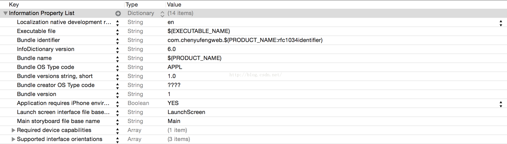

[Quick Start for Property Lists](https://developer.apple.com/library/content/documentation/Cocoa/Conceptual/PropertyLists/QuickStartPlist/QuickStartPlist.html)

@img 

@img 
```XML
<?xml version="1.0" encoding="UTF-8"?>
<!DOCTYPE plist PUBLIC "-//Apple//DTD PLIST 1.0//EN" "http://www.apple.com/DTDs/PropertyList-1.0.dtd">
<plist version="1.0">
<dict>
    <key>Name</key>
    <string>John Doe</string>
    <key>Phones</key>
    <array>
        <string>408-974-0000</string>
        <string>503-333-5555</string>
    </array>
</dict>
</plist>
```

- [How to read Array from plist iOS](http://stackoverflow.com/questions/16269126/how-to-read-array-from-plist-ios)  
- [Loading Array From .Plist](http://stackoverflow.com/questions/6977015/loading-array-from-plist)  

[iOS项目开发实战——plist数组解析](http://blog.csdn.net/chenyufeng1991/article/details/47780371)

[plist真心总结](http://blog.csdn.net/huifeidexin_1/article/details/7487868)

[Converting an “NS.time” from plist to an actual time](http://stackoverflow.com/questions/26274376/converting-an-ns-time-from-plist-to-an-actual-time)  
[将"NS.time"从 plist 转换为实际的时间](http://www.itstrike.cn/Question/0013acae-89eb-4547-b616-0f3771627d6a.html)  

[How to store time and date in plist and compare it with now time iOS 7](http://stackoverflow.com/questions/23789508/how-to-store-time-and-date-in-plist-and-compare-it-with-now-time-ios-7)

