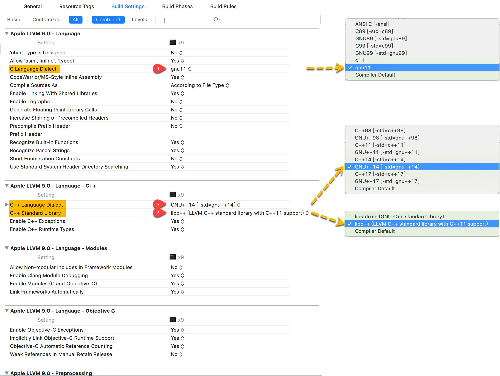

## Build Options
Compiler for C/C++/Objective-C：

- Xcode 8.3：Default compiler(Apple LLVM 8.1)  
- Xcode 9：Default compiler(Apple LLVM 9.0)  

## Language Dialect
[Language Standards Supported by GCC](https://gcc.gnu.org/onlinedocs/gcc/Standards.html)  
[**Options Controlling C Dialect**](https://gcc.gnu.org/onlinedocs/gcc/C-Dialect-Options.html)  

以下为 XCode | Project | Target | Build Settings 的截图。



### [C Language Dialect](http://blog.csdn.net/letshi/article/details/70599088)
Apple LLVM 9.0 - Language | C Language Dialect 对应 project.pbxproj 中 buildSettings 字典的 key =`GCC_C_LANGUAGE_STANDARD`。

Apple LLVM 8.1 & 9.0 支持的 **GCC_C_LANGUAGE_STANDARD** 有以下8种：

- "ansi";                       // ANSI C[-ansi]  
- "c89";                        // C89[-std=c89]  
- "gnu89";                   // GNU89[-std=gnu89]  
- "c99";                        // C99[-std=c99]  
- "gnu99";                   // GNU99[-std=gnu99]  
- "c11";                        // c11  
- "gnu11";                   // gnu11  
- "compiler-default"; // Compiler Default  

 Xcode 8 默认（Compiler Default）选择 `GNU99`；最新 Xcode 9 默认选择 `gnu11`。

#### references
[Status of C99 features in GCC](https://gcc.gnu.org/c99status.html)  
[What's the difference between GNU99 and C99 (Clang)?](https://stackoverflow.com/questions/5313536/whats-the-difference-between-gnu99-and-c99-clang)  
[Signals - c99 vs gnu99](https://stackoverflow.com/questions/8288164/signals-c99-vs-gnu99)  

### [C++ Language Dialect](http://blog.csdn.net/letshi/article/details/70808558)
Apple LLVM 9.0 - Language - C++ | C++ Language Dialect 对应 project.pbxproj 中 buildSettings 字典的 key = `CLANG_CXX_LANGUAGE_STANDARD`。

Apple LLVM 8.1 支持的 **CLANG_CXX_LANGUAGE_STANDARD** 有以下7种：

- "c++98";                   // C++98[-std=c++98]  
- "gnu++98";              // GNU++98[-std=gnu++98]  
- "c++0x";                   // C++11[-std=c++11]  
- "gnu++0x";              // GNU++11[-std=gnu++11]  
- "c++14";                   // C++14[-std=c++14]  
- "gnu++14";              // GNU++14[-std=gnu++14]  
- "compiler-default"; // Compiler Default  

Apple LLVM 9.0 相比 8.1 增加支持 C++17 和 gnu++17：

- "c++17";                  // C++11[-std=c++17]  
- "gnu++17";             // GNU++11[-std=gnu++17]  

Xcode 8 默认（Compiler Default）选择 `GNU++11`；最新 Xcode 9 默认选择 `GNU++14`。

---

C++ 版本里程碑时间线参考下图：


C++ 各版本特性对应的编译器支持情况 ，可查表 [C++ compiler support](http://en.cppreference.com/w/cpp/compiler_support)。

#### references
[ANSI C, Standard C 与 GCC](http://www.jianshu.com/p/3756ccb7c0c2)  
[C语言的各种版本：C89，AMD1，C99，C11](https://www.crifan.com/summary_c_language_version_c89_amd1_c99_c11/)  
History of C++：[cppreference](http://en.cppreference.com/w/cpp/language/history) / [cplusplus](http://www.cplusplus.com/info/history/)  

[C11Status](https://gcc.gnu.org/wiki/C11Status)  
[Linux Kernel Working Towards GNU11/C11 Compatibility](http://www.phoronix.com/scan.php?page=news_item&px=MTgxODI)  
[What is the default C mode for the current gcc (especially on Ubuntu)?](https://stackoverflow.com/questions/14737104/what-is-the-default-c-mode-for-the-current-gcc-especially-on-ubuntu)  
[What are the differences between -std=c++11 and -std=gnu++11?](https://stackoverflow.com/questions/10613126/what-are-the-differences-between-std-c11-and-std-gnu11)  

> the difference between the two options is whether GNU extensions that violates the C++ standard are **enabled** or not. The GNU extensions are described [here](https://gcc.gnu.org/onlinedocs/gcc/C_002b_002b-Extensions.html).

## C++ Standard Library
Apple LLVM 9.0 - Language - C++ | C++ Standard Library 对应 project.pbxproj 中 buildSettings 字典的 key = `CLANG_CXX_LIBRARY`。

Apple LLVM 8.1 & 9.0 支持的 **CLANG_CXX_LIBRARY** 有以下3种：

- "libstdc++";              // libstdc++(GNU C++ standard library)  
- "libc++";                   // libc++(LLVM C++ standard library with C++11 support)  
- "compiler-default"; // Compiler Default  

最新 Xcode 9 默认选择 `libc++`。

如果选择 `libstdc++`，则会发出 deprecated 警告：

> clang: warning: libstdc++ is deprecated; move to libc++ [-Wdeprecated]

### libstdc++
libstdc++ —— [The GNU C++ Library](https://gcc.gnu.org/onlinedocs/gcc-7.2.0/libstdc++/manual/)  

libstdc++ 4.2 is the last GPL2 version.
Mainline libstdc++ has switched to GPL3, a license which the developers of libc++ cannot use. 

### libc++
libc++ —— [LLVM's C++ standard library](http://libcxx.llvm.org/), targeting C++11(the C++0x standard).  

[LLVM Replaces libstdc++ Library With libc++](http://www.phoronix.com/scan.php?page=news_item&px=ODI1NQ)  

> The LLVM project has introduced libc++ as a replacement for the GNU libstdc++ standard library.

[linux下编译clang, libc++, libc++abi](http://blog.csdn.net/heartszhang/article/details/17652461)  
[Linux下编译clang、libcxx及其相关库——C++11环境搭建](http://blog.csdn.net/vloong/article/details/19070443)  

## Header Search Paths
[LLVM](https://en.wikipedia.org/wiki/LLVM) currently supports compiling of C, C++, Objective-C and Swift using various front ends, some derived from version 4.0.1 and 4.2 of the GNU Compiler Collection (GCC).  
The LLVM project includes an implementation of the C++ Standard Library.  

If you want to see your header include paths for libstdc++ and libc++, do this:

```Shell
# GNU C++ runtime
$ echo | /usr/local/bin/clang++ -Wp,-v -stdlib=ibstdc++ -x c++ - -fsyntax-only
```

And:

```Shell
# LLVM C++ runtime
$ echo | /usr/local/bin/clang++ -Wp,-v -stdlib=libc++ -x c++ - -fsyntax-only
```

[在xcode中设置include和lib路径](http://www.cnblogs.com/palance/p/4809978.html)  
[OS X clang include lib search path](https://langui.sh/2015/07/24/osx-clang-include-lib-search-paths/)  
[**Include search path on Mac OSX Yosemite 10.10.1**](https://stackoverflow.com/questions/27948093/include-search-path-on-mac-osx-yosemite-10-10-1)  

### [clang](http://clang.llvm.org/docs/LanguageExtensions.html)
运行 **`clang -x c -v -E /dev/null`** 可以查看 C 语言的 Header Search Paths：

```Shell
#include "..." search starts here:
#include <...> search starts here:
 /usr/local/include
 /Applications/Xcode-beta.app/Contents/Developer/Toolchains/XcodeDefault.xctoolchain/usr/lib/clang/9.0.0/include
 /Applications/Xcode-beta.app/Contents/Developer/Toolchains/XcodeDefault.xctoolchain/usr/include
 /Applications/Xcode-beta.app/Contents/Developer/Platforms/MacOSX.platform/Developer/SDKs/MacOSX10.13.sdk/usr/include
 /Applications/Xcode-beta.app/Contents/Developer/Platforms/MacOSX.platform/Developer/SDKs/MacOSX10.13.sdk/System/Library/Frameworks (framework directory)
End of search list.
```

运行 **`clang -x c++ -v -E /dev/null`**，在 `InstalledDir` 中多出 `-stdlib=libc++`，此即为 LLVM's C++ standard library。  
同时，C++ 语言的 Header Search Paths，较 C 语言在 `/usr/local/include` 之后增加了以下路径：

```Shell
 /Applications/Xcode-beta.app/Contents/Developer/Toolchains/XcodeDefault.xctoolchain/usr/include/c++/v1
```

search list 顺序如下：

1. /usr/local/include  
2. XcodeDefault.xctoolchain/usr/include/c++/v1 (only for C++)  
3. XcodeDefault.xctoolchain/usr/lib/clang/9.0.0/include  
4. XcodeDefault.xctoolchain/usr/include  
5. MacOSX10.13.sdk/usr/include  
6. MacOSX10.13.sdk/System/Library/Frameworks (framework directory)  

以上即为选择 CLANG_CXX_LIBRARY =*`libc++`* 时的头文件搜索路径。

### [gcc](https://stackoverflow.com/questions/39829340/which-version-of-gcc-is-installed-on-mac-yosemite)
LLVM allows code to be compiled statically, as it is **under** the traditional GCC system.  
XCode gcc and clang are linked to the same binary in the SDK.  

在 macOS 终端运行 `xcrun -f gcc` 命令可查找到 [gcc](https://stackoverflow.com/questions/39829340/which-version-of-gcc-is-installed-on-mac-yosemite) 在目录 `/Applications/Xcode-beta.app/Contents/Developer/usr/bin/` 下：

```Shell
⇒  xcrun -f gcc
/Applications/Xcode-beta.app/Contents/Developer/usr/bin/gcc
```

> `/Applications/Xcode-beta.app/Contents/Developer/usr/lib/llvm-gcc/4.2.1/libgcc.a`?

运行 `clang -v` 和 `gcc -v` 查看 clang 和 gcc 的版本详细信息(verbose)。  
由 **InstalledDir** 可以看出 gcc 实际上是 XcodeDefault.xctoolchain 下 clang 的 [shims or wrapper](http://stackoverflow.com/questions/9329243/xcode-4-4-and-later-install-command-line-tools/) executables。

```
⇒  clang -v
Apple LLVM version 9.0.0 (clang-900.0.35)
Target: x86_64-apple-darwin16.7.0
Thread model: posix
InstalledDir: /Applications/Xcode-beta.app/Contents/Developer/Toolchains/XcodeDefault.xctoolchain/usr/bin

⇒  gcc -v
Configured with: --prefix=/Applications/Xcode-beta.app/Contents/Developer/usr --with-gxx-include-dir=/Applications/Xcode-beta.app/Contents/Developer/Platforms/MacOSX.platform/Developer/SDKs/MacOSX10.13.sdk/usr/include/c++/4.2.1
Apple LLVM version 9.0.0 (clang-900.0.35)
Target: x86_64-apple-darwin16.7.0
Thread model: posix
InstalledDir: /Applications/Xcode-beta.app/Contents/Developer/Toolchains/XcodeDefault.xctoolchain/usr/bin
```

从配置信息(**Configured with**) 中可以看出 `--with-gxx-include-dir` 目录为 SDK(MacOSX.sdk、iPhoneOS.sdk) 下的 `/usr/include/c++/4.2.1`，此即为选择 CLANG_CXX_LIBRARY =*`libstdc++`* 时的头文件搜索路径。

#### tr1
`/usr/include/c++/4.2.1` 下的 `tr1/` 为 TR1 扩展库头文件：

> [C++ Technical Report 1](https://en.wikipedia.org/wiki/C%2B%2B_Technical_Report_1)(TR1) is the common name for ISO/IEC TR 19768, C++ Library Extensions.  
> MSDN: [Standard C++ Library TR1 Extensions Reference](https://msdn.microsoft.com/en-us/library/bb982198(v=vs.90).aspx)  

TR1 was published in 2007 as an ISO/IEC standard as [ISO/IEC TR 19768:2007](http://www.iso.org/iso/iso_catalogue/catalogue_ics/catalogue_detail_ics.htm?ics1=35&ics2=60&ics3=&csnumber=43289), C++11 was published as ISO/IEC 14882:2011.  
Before C++11 was standardized, vendors used this document as a guide to create extensions.  

查表 [C++ compiler support](http://en.cppreference.com/w/cpp/compiler_support) 可知，gcc 4.3 才开始支持 C++11 的 Type traits、tuple、Lambda expressions（functional）、array、regex 等特性。  
Xcode 工具链包含的 llvm-gcc 版本为 4.2.1 (libstdc++ 4.2 is the last **GPL2** version)，尚不支持 C++11，只能采用 TR1 扩展库实现部分 C++11 等效特性。  

```CPP
#include <tr1/array>
#include <tr1/tuple>
#include <tr1/type_traits>
#include <tr1/unordered_map>
```

Xcode 建议选择默认的 CLANG_CXX_LIBRARY = `libc++`，不要选择陈旧的 `libstdc++`，否则会发出 deprecated warning。  

## Library Search Paths

```Shell
⇒  clang -Xlinker -v
@(#)PROGRAM:ld  PROJECT:ld64-302.3
configured to support archs: armv6 armv7 armv7s arm64 i386 x86_64 x86_64h armv6m armv7k armv7m armv7em (tvOS)
Library search paths:
	/usr/local/lib
	/Applications/Xcode-beta.app/Contents/Developer/Platforms/MacOSX.platform/Developer/SDKs/MacOSX10.13.sdk/usr/lib
Framework search paths:
	/Applications/Xcode-beta.app/Contents/Developer/Platforms/MacOSX.platform/Developer/SDKs/MacOSX10.13.sdk/System/Library/Frameworks/
Undefined symbols for architecture x86_64:
  "_main", referenced from:
     implicit entry/start for main executable
ld: symbol(s) not found for architecture x86_64
clang: error: linker command failed with exit code 1 (use -v to see invocation)
```

SDK(MacOSX.sdk、iPhoneOS.sdk) 目录 `/usr/lib/` 下包含 libc++.1.tbd 和 libstdc++.6.0.9.tbd。  
使用文本编辑器打开 tbd 文件，可以看到其 **install-name** 分别为 `libc++.dylib` 和 `libstdc++.dylib`。
